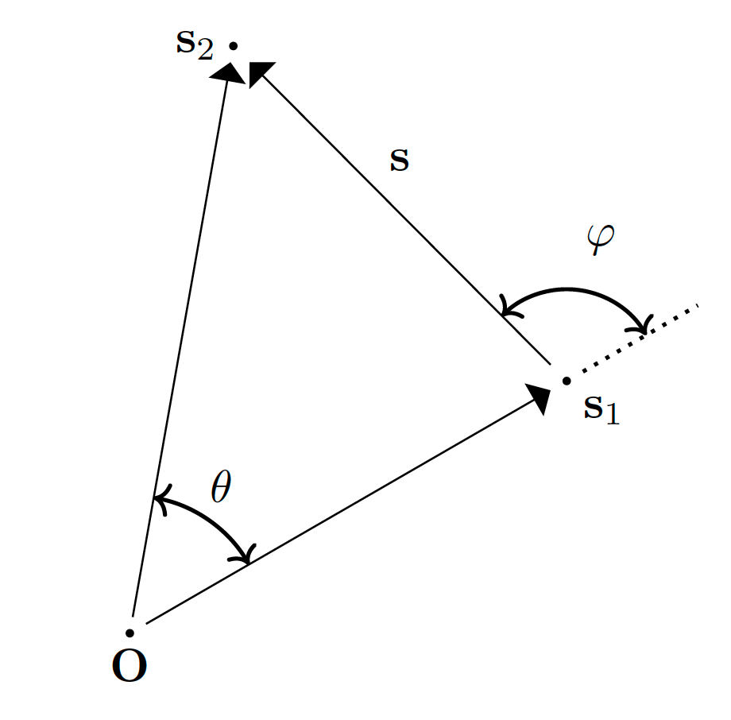

# The ``\Delta\chi \rightarrow 0`` limits

All the Two-Point Correlation Functions (TPCFs) that require an integration over one or two
comoving distances ``\chi`` share the same structure: their integrand is a sum of terms

```math
    \sum_k J^{(k)}(\chi, s, y) \; I_{\ell_k}^{n_k}(\Delta\chi) \; ,
```

where ``\Delta\chi`` is the distance between the two points that are being correlated and the
``J^{(k)}`` are rational functions of the comoving distances and of the angle cosine ``y``.
Several of these ``I_\ell^n`` diverge for ``\Delta\chi \rightarrow 0``, and several of the
``J^{(k)}`` diverge as well: individually the terms are singular, while their sum is finite.

This page derives that finite value for every affected TPCF. The results are the ones used in
the `Δχ < Δχ_min` branch of the corresponding `integrand_ξ_...` functions.

## Definitions and why the limit is needed

We report here the important definitions:



```math
\Delta\chi := \sqrt{\chi_1^2 + \chi_2^2 - 2 \, \chi_1 \, \chi_2 \,y} \quad \quad (1.1) \\[10pt]

\Delta\chi_1 := \sqrt{\chi_1^2 + s_2^2 - 2 \, \chi_1 \,s_2 \,y} \quad \quad (1.2) \\[10pt]
\Delta\chi_2 := \sqrt{s_1^2 + \chi_2^2 - 2 \,s_1 \,\ \chi_2 \,y} \quad \quad (1.3)  \\[10pt]

(1.4\mathrm{a}): \quad y = \cos{\theta} := \hat{\mathbf{s}}_1 \cdot \hat{\mathbf{s}}_2 \quad \Rightarrow \quad \; -1 \leq y \leq 1 \\[16pt]
```


```math
\begin{align*}
    %%%%%%%%%%%%%%%%%%%%%%%%%%%%%%%%%%%%%
    y &= \cos \theta = \hat{\mathbf{s}}_1 \cdot  \hat{\mathbf{s}}_2 
        \quad &(1.4\mathrm{a}) \quad
    && \mu &= \cos \varphi = \hat{\mathbf{s}}_1 \cdot  \hat{\mathbf{s}} 
        \quad &(1.4\mathrm{b}) \\[15pt]
    %%%%%%%%%%%%%%%%%%%%%%%%%%%%%%%%%%%%%
    s(s_1, s_2, y) &= \sqrt{s_1^2 + s_2^2 - 2 \, s_1 \, s_2 \, y} 
        \quad &(1.5\mathrm{a}) \quad
    && s_2(s_1, s, \mu) &= \sqrt{s_1^2 + s^2 + 2 \, s_1 \, s \, \mu} 
        \quad &(1.5\mathrm{b})\\[15pt]
    %%%%%%%%%%%%%%%%%%%%%%%%%%%%%%%%%%%%%
    \mu(s_1, s_2, y) &= \frac{y \, s_2 - s_1}{s(s_1, s_2, y)} 
        \quad &(1.6\mathrm{a})\quad
    && y(s_1, s, \mu) &= \frac{\mu \, s + s_1}{s_2(s_1, s, \mu)}
        \quad &(1.6\mathrm{b})
    %%%%%%%%%%%%%%%%%%%%%%%%%%%%%%%%%%%%%
\end{align*}
```


We will consider only ``\Delta\chi`` in the following steps, but the analysis is the same:

```math
\begin{align*}
\Delta\chi^2 &= \chi_1^2 + \chi_2^2 - 2\,\chi_1\chi_2 \,y  \\[10pt]
&= \chi_1^2 + \chi_2^2 - 2\,\chi_1\chi_2 + 2\,\chi_1\chi_2 - 2\,\chi_1\chi_2 \,y  \\[10pt]
&= (\chi_1-\chi_2)^2 + 2\chi_1\chi_2(1-y)\\[10pt]
&\quad\quad\quad (\chi_1-\chi_2)^2 \geq 0 \;, \quad \forall\chi_1,\chi_2\in \mathbb{R}\\[10pt]
&\quad\quad\quad 2\chi_1\chi_2(1-y)\geq 0 \quad \forall\chi_1,\chi_2\in \mathbb{R}\;, \quad \forall y \in [-1,1]\\[10pt]

\quad\quad \Delta\chi = 0\, &\iff y=1 \; \land \; \chi_1=\chi_2 \quad\quad (1.7\mathrm{a})\\[10pt]
\Rightarrow \quad \Delta\chi_1 = 0 &\iff y=1 \; \land \; \chi_1=s_2 \quad\quad (1.7\mathrm{b})\\[10pt]
\quad\quad \Delta\chi_2 = 0 &\iff y=1 \; \land \; s_1=\chi_2 \quad\quad (1.7\mathrm{c})\\[10pt]
\end{align*}
```

Putting the condition ``y=1`` into Eq. (1.6b) and Eq. (1.5b):

```math
\begin{align*}
(1.6\mathrm{b}) \; \mathrm{and} \; (1.6\mathrm{a})  \; : \quad y = 1 &\iff 1 = y(s_1, s, \mu) = \frac{\mu \, s + s_1}{s_2(s_1, s, \mu)} =  \frac{\mu \, s + s_1}{\sqrt{s_1^2 + s^2 + 2 \, s_1 \, s \, \mu} }\\[10pt]
&\iff s_1^2 + s^2 + 2 \, s_1 \, s \, \mu = \left(\mu \, s + s_1 \right)^2 \\[10pt]
&\iff s_1^2 + s^2 + 2 \, s_1 \, s \, \mu = \mu^2 \, s^2 + s_1^2 + 2 \, s_1 \, s \, \mu \\[10pt]
&\iff s^2 (1 - \mu^2) = 0 \\[10pt]
&\iff \mu = \pm 1 \\[15pt]
\Rightarrow \quad y=1&\iff \mu = \pm 1 \quad \quad (1.8)\\[10pt]
\end{align*}
```

We then understand that ``\Delta\chi = 0`` is not a pathological configuration that can be avoided: it is reached deterministically by the quadrature.

The nodes ``\mu = \pm 1`` belong to the Gauss-Lobatto grid (`alg = :lobatto`) and to the trapezoidal grid (`alg = :trap`); only `alg = :quad` avoids them (which is a problem, because are the parts that contributes the most).

``\chi_1 = \chi_2`` is hit whenever a sampling point of the ``\chi`` grid coincides with the other distance. With `suit_sampling = true` this is not even accidental: `sample_subdivision_middle` deliberately places a dense, symmetric sub-grid around the singular point, because that is where the integrand varies fastest.

## How the limit is taken

We got the limit in the Iln Integral page:

```math
\boxed{
    I_\ell^n(s) \; \underset{s \rightarrow 0}{\sim}  \;
        \frac{\sigma_{n-\ell}}{(2\ell+1)!!} \, s^{\,\ell - n} 
}
\quad \quad (2.1\mathrm{a})
\qquad\qquad
\boxed{
    \tilde{I}_0^4(s) \; \underset{s \rightarrow 0}{\sim} \; - \frac{\sigma_2}{6 \, s^2}
}
\quad \quad (2.1\mathrm{b})
```

So, written explicitly:
```math
\begin{align*}
I_0^0           &\sim \sigma_0                         &&\rightarrow \mathrm{const} \quad\quad\quad
    &I_2^2           &\sim \frac{\sigma_0}{15}              &&\rightarrow \mathrm{const} \\[10pt]
I_2^0           &\sim \frac{\sigma_{-2}}{15} \, s^2    &&\rightarrow 0              
    & I_3^1          &\sim \frac{\sigma_{-2}}{105} \, s^2   &&\rightarrow 0              \\[10pt]
I_4^0           &\sim \frac{\sigma_{-4}}{945} \, s^4   &&\rightarrow 0              
    &I_1^3           &\sim \frac{\sigma_2}{3} \, s^{-2}     &&\rightarrow +\infty        \\[10pt]
I_0^2           &\sim \sigma_2 \, s^{-2}               &&\rightarrow +\infty        
    &I_1^1           &\sim \frac{\sigma_0}{3}               &&\rightarrow \mathrm{const} \\[10pt]
\end{align*}
```

```math
\tilde{I}_0^4   \sim -\frac{\sigma_2}{6}\, s^{-2}     \rightarrow +\infty\\[10pt]
```

Since ``\Delta\chi \rightarrow 0`` forces both ``\chi_2 \rightarrow \chi_1`` and ``y \rightarrow 1``,
the limit is a joint one and must be checked to be independent of the direction of approach.
We therefore parametrise the approach with a single parameter ``p``,

```math
    \chi_2 := \chi_1 + p \, \Delta\chi  \quad \quad (2.2)\\[10pt]
    |\chi_1 - \chi_2| \leq \Delta\chi \quad \Rightarrow \quad |p| \leq 1
```
NOTE: the bound on ``p`` follows from ``|\chi_1 - \chi_2| \leq \Delta\chi``

```math
\begin{align*}
\mathrm{Inverting \; }(1.1)\; : \quad 
    y &= \frac{\chi_1^2 + \chi_2^2 - \Delta\chi^2}{2 \, \chi_1 \chi_2} \\[10pt]
      &= \frac{\chi_1^2 + \chi_1^2 + p^2 \Delta\chi^2 + 2 \chi_1 p \Delta \chi - \Delta\chi^2}{2 \, \chi_1 (\chi_1 + p \Delta \chi)} \\[10pt]
      &= \frac{2\chi_1^2 + 2 \chi_1 p \Delta \chi - (1-p^2)\Delta\chi^2}{2 \, \chi_1 (\chi_1 + p \Delta \chi)} \\[10pt]

\Rightarrow \quad 
    y-1  &= \frac{2\chi_1^2 + 2 \chi_1 p \Delta \chi - (1-p^2)\Delta\chi^2 }{2 \, \chi_1 (\chi_1 + p \Delta \chi)} -1 \\[10pt]
        &= \frac{2\chi_1^2 + 2 \chi_1 p \Delta \chi - (1-p^2)\Delta\chi^2 - 2 \chi_1^2 - 2 \chi_1 p \Delta \chi}{2 \, \chi_1 (\chi_1 + p \Delta \chi)} \\[10pt]
        &= - \frac{(1-p^2)\Delta\chi^2}{2 \, \chi_1 (\chi_1 + p \Delta \chi)} \\[10pt]
        &\underset{\Delta\chi \rightarrow 0^{+}}{\sim} - \frac{(1-p^2)}{2\chi_1^2}\Delta\chi^2 \\[10pt]

\Rightarrow \quad 
    y^2-1  &= (y-1)(y+1)\\[10pt]
        &= - \frac{(1-p^2)\Delta\chi^2}{2 \, \chi_1 (\chi_1 + p \Delta \chi)} 
        \left[ \frac{2\chi_1^2 + 2 \chi_1 p \Delta \chi - (1-p^2)\Delta\chi^2 }{2 \, \chi_1 (\chi_1 + p \Delta \chi)} +1 \right] \\[10pt]
        &= - \frac{(1-p^2)\Delta\chi^2 [4\chi_1^2 + 4 \chi_1 p \Delta \chi + (1+p^2)\Delta\chi^2]}{4 \, \chi_1^2 (\chi_1 + p \Delta \chi)^2} 
        \\[10pt]
        &\underset{\Delta\chi \rightarrow 0^{+}}{\sim}- \frac{(1-p^2)}{\chi_1^2}\Delta\chi^2 \\[15pt]

\end{align*}
```

```math
\Rightarrow \quad 
    y-1  \underset{\Delta\chi\rightarrow 0^{+}}{\sim}  - \frac{(1-p^2)}{2\chi_1^2}\Delta\chi^2
    \quad \quad (2.3\mathrm{a})
    \quad , \quad \quad \quad 
    y^2-1 \underset{\Delta\chi \rightarrow 0^{+}}{\sim}- \frac{(1-p^2)}{\chi_1^2}\Delta\chi^2
    \quad \quad (2.3\mathrm{b}) \\[10pt]
```

We then expand each ``J\, I_{\ell}^{n}`` in powers of ``\Delta\chi`` and keep the ``\Delta\chi^0`` coefficient.
**If the result still depends on ``p``, it means that the limit does not exist**; in all the
cases below the ``p``-dependence cancels in the sum, which is a strong consistency check.

### A trap: the two small parameters are NOT of the same order

This is the single easiest way to get these limits wrong, so it deserves to be spelled out.

Along the path ``\chi_2 = \chi_1 + p\,\Delta\chi`` the two quantities that vanish do so at
**different rates**:

```math
    \chi_2 - \chi_1 = p \, \Delta\chi = \mathcal{O}(\Delta\chi) \; ,
    \qquad \qquad
    y - 1 \; \sim \; -\frac{(1-p^2)}{2\chi_1^2}\Delta\chi^2 = \mathcal{O}(\Delta\chi^2) \; .
    \quad \quad (2.4)
```

Consequently, inside a bracket that vanishes at the singular point:

```math
    \underbrace{(\chi_1-\chi_2)^2}_{\mathcal{O}(\Delta\chi^2)}
    \quad \mathrm{and} \quad
    \underbrace{(y-1)}_{\mathcal{O}(\Delta\chi^2)}
    \quad \mathrm{contribute \; at \; the \; SAME \; order.}
    \quad \quad (2.5)
```

**So one must never set ``\chi_1 = \chi_2`` first and expand in ``y`` afterwards.** Doing so
silently throws away every term quadratic in ``(\chi_1 - \chi_2)``, which is exactly as large
as the ``(y-1)`` terms that are being kept.

A concrete example, the one that matters most below. Take the square bracket of
``J^{\kappa\kappa}_{00}``:

```math
    B_{00} := 8 y (\chi_1^2 + \chi_2^2) - \chi_1\chi_2 (9y^2+7) \; .
```

It is true that ``B_{00} \rightarrow 0`` when ``y \rightarrow 1`` **and**
``\chi_2 \rightarrow \chi_1`` together. But if we only set ``y = 1``, keeping
``\chi_1 \neq \chi_2``, we get

```math
    B_{00}\big|_{y=1} = 8(\chi_1^2+\chi_2^2) - 16\chi_1\chi_2 = 8(\chi_1-\chi_2)^2
    = 8 p^2 \Delta\chi^2 \; \neq \; 0 \; ,
    \quad \quad (2.6)
```

which is ``\mathcal{O}(\Delta\chi^2)``: precisely the order we are trying to extract.
Conversely, setting ``\chi_1 = \chi_2`` first gives
``B_{00}\big|_{\chi_1=\chi_2} = \chi_1^2\,(16y - 9y^2 - 7) = -\chi_1^2 (y-1)(9y-7)``,
which at ``y \rightarrow 1`` is ``2\chi_1^2(1-y)``, i.e. it keeps **only** the
``(y-1)`` half of the answer and loses the ``8p^2\Delta\chi^2`` of Eq.(2.6).

The safe recipe, used systematically below, is:

> Rewrite the bracket **exactly** — no approximation — as a combination of the vanishing
> quantities ``(\chi_1-\chi_2)``, ``(y-1)`` and ``(y^2-1)``, with coefficients that are
> regular at the singular point. Only then substitute the leading orders (2.2), (2.3), (2.4).


## Family 1: Lensing ``\times`` Lensing

Concerned functions: `integrand_ξ_GNC_Lensing`, `integrand_ξ_LD_Lensing`,
`integrand_ξ_GNCxLD_Lensing_Lensing`.

The analytical expression of the function `integrand_ξ_GNC_Lensing` is the following:

```math
f^{\kappa\kappa} (\chi_1, \chi_2, s_1, s_2, y) = 
J^{\kappa\kappa}_{\alpha}
\left[
    J^{\kappa\kappa}_{00} I_0^0(\Delta\chi) + 
    J^{\kappa\kappa}_{02} I_2^0(\Delta\chi) +
    J^{\kappa\kappa}_{31} I_1^3(\Delta\chi) +
    J^{\kappa\kappa}_{22} I_2^2(\Delta\chi)
\right]  \, , 
```

with

```math
\begin{align*}
    J^{\kappa\kappa}_{\alpha} & = 
    \frac{
        \mathcal{H}_0^4 \Omega_{\mathrm{M}0}^2 D(\chi_1) D(\chi_2) 
    }{
        s_1 s_2 a(\chi_1) a(\chi_2)}
    (\chi_1 - s_1)(\chi_2 - s_2)
    (5 s_{\mathrm{b}, 1} - 2)(5 s_{\mathrm{b}, 2} - 2) 
    \, , \\
    %%%%&%%%%%%%%%%%%%
    J^{\kappa\kappa}_{00} & = 
    -\frac{3}{4}\frac{\chi_1^2 \chi_2^2}{\Delta\chi^4} (y^2 - 1)
    \left[
        8 y (\chi_1^2 + \chi_2^2) - \chi_1\chi_2 (9y^2+7)
    \right] 
    \, , \\
    %%%%&%%%%%%%%%%%%%
    J^{\kappa\kappa}_{02} & = 
    -\frac{3}{2}\frac{\chi_1^2 \chi_2^2}{\Delta\chi^4}(y^2 - 1)
    \left[
        4 y (\chi_1^2 + \chi_2^2) - \chi_1 \chi_2 (3 y^2 + 5)
    \right] 
    \, , \\
    %%%%%%%%%%%%%%%%%%
    J^{\kappa\kappa}_{31} & = 9 y \Delta\chi^2 
    \, , \\
    %%%%%%%%%%%%%%%%%%
    J^{\kappa\kappa}_{22} & = 
    \frac{9}{4}\frac{\chi_1 \chi_2}{\Delta\chi^4}
    \left[
        2(\chi_1^4 + \chi_2^4)(7 y^2 - 3) - 
        16 y \chi_1 \chi_2 (\chi_1^2 + \chi_2^2)(y^2 + 1) + 
        \chi_1^2 \chi_2^2 (11y^4 + 14y^2 + 23) 
    \right] 
    \, .
\end{align*}
```


We abbreviate the three square brackets as

```math
\begin{align*}
    B_{00} &:= 8 y (\chi_1^2 + \chi_2^2) - \chi_1\chi_2 (9y^2+7) \; , \\[6pt]
    B_{02} &:= 4 y (\chi_1^2 + \chi_2^2) - \chi_1\chi_2 (3y^2+5) \; , \\[6pt]
    B_{22} &:= 2(\chi_1^4 + \chi_2^4)(7 y^2 - 3) - 16 y \chi_1 \chi_2 (\chi_1^2 + \chi_2^2)(y^2 + 1)
        + \chi_1^2 \chi_2^2 (11y^4 + 14y^2 + 23) \; ,
\end{align*}
```

so that

```math
    J^{\kappa\kappa}_{00} = -\frac{3}{4}\frac{\chi_1^2\chi_2^2}{\Delta\chi^4}(y^2-1) B_{00}
    \; , \quad
    J^{\kappa\kappa}_{02} = -\frac{3}{2}\frac{\chi_1^2\chi_2^2}{\Delta\chi^4}(y^2-1) B_{02}
    \; , \quad
    J^{\kappa\kappa}_{22} = \frac{9}{4}\frac{\chi_1\chi_2}{\Delta\chi^4} B_{22} \; .
    \quad \quad (3.1)
```

All three brackets vanish at the singular point ``y=1 \land \chi_1 = \chi_2 = \chi``:

```math
\begin{align*}
y=1 \; &\land \; \chi_1 = \chi_2 = \chi \; : \\[10pt]
    B_{00} &= 8(2\chi^2) - \chi^2 (9+7) = 16\chi^2 - 16\chi^2 = 0 \; , \\
    B_{02} &= 4(2\chi^2) - \chi^2 (3+5) = 8\chi^2 - 8\chi^2 = 0 \; , \\
    B_{22} &= 2(2\chi^4)(7-3) - 16\chi^2(2\chi^2)(1+1) + \chi^4(11+14+23)
        = 16\chi^4 - 64\chi^4 + 48\chi^4 = 0 \; ,
\end{align*}
```

so the leading order is not enough and the expansion must be pushed further.


### Term 1: ``J_{00} I_0^0``


```math
\begin{align*}
    B_{00} &= 8 y (\chi_1^2 + \chi_2^2) - \chi_1\chi_2 (9y^2+7) \\[10pt]
    8y = 8 + 8(y-1) \; \rightarrow \quad
        &= [8+8(y-1)](\chi_1^2+\chi_2^2) - \chi_1\chi_2 (9y^2+7) \\[10pt]
        &= 8(\chi_1^2+\chi_2^2) + 8(y-1)(\chi_1^2+\chi_2^2) - \chi_1\chi_2 (9y^2+7) \\[10pt]
    9y^2+7 = 16 + 9(y^2-1) \; \rightarrow \quad
        &= 8(\chi_1^2+\chi_2^2) + 8(y-1)(\chi_1^2+\chi_2^2) - \chi_1\chi_2[16+9(y^2-1)] \\[10pt]
        &= 8(\chi_1^2+\chi_2^2) - 16\chi_1\chi_2
            + 8(y-1)(\chi_1^2+\chi_2^2) - 9\chi_1\chi_2(y^2-1) \\[10pt]
        &= 8(\chi_1-\chi_2)^2
            + 8(y-1)(\chi_1^2+\chi_2^2) - 9\chi_1\chi_2(y^2-1) \; . \quad \quad (3.2)\\[10pt]
    (2.2),\; (2.3\mathrm{a}),\; &(2.3\mathrm{b})\; \quad\rightarrow \quad
        (\chi_2-\chi_1)=p\Delta\chi \; , \quad (\chi_1^2+\chi_2^2)=2\chi_1^2\\[10pt]
    &\underset{\Delta\chi\rightarrow 0^{+}}{\sim}
        8 \, p^2\Delta\chi^2
        + 8 \left[- \frac{(1-p^2)}{2\cancel{\chi_1^2}}\Delta\chi^2\right] 2\cancel{\chi_1^2}
        - 9 \cancel{\chi_1^2} \left[- \frac{(1-p^2)}{\cancel{\chi_1^2}}\Delta\chi^2\right] \\[10pt]
    &= \left[ 8p^2 - 8(1-p^2) + 9(1-p^2) \right] \Delta\chi^2 \\[10pt]
    &= \left[ 8p^2 + (1-p^2) \right] \Delta\chi^2 \\[10pt]
    &= \left( 1 + 7p^2 \right) \Delta\chi^2 \; . \quad \quad (3.3) \\[15pt]
\end{align*}
```


```math
\begin{align*}
    \Rightarrow \quad 
    J_{00} I_0^0 &= -\frac{3}{4}\frac{\chi_1^2\chi_2^2}{\Delta\chi^4}(y^2-1) \, B_{00} \, I_0^0 \\[10pt]
    (2.1\mathrm{a})\, ,\;(2.2)\, , \;  (2.3\mathrm{a}) \rightarrow \quad
    &\underset{\Delta\chi\rightarrow 0^{+}}{\sim}
        -\frac{3}{4}\frac{\chi_1^4}{\Delta\chi^4}
        \left[- \frac{(1-p^2)}{\chi_1^2}\Delta\chi^2\right]
        \left( 1 + 7p^2 \right) \Delta\chi^2 \; \sigma_0 \\[10pt]
    &= \frac{3}{4}\frac{\chi_1^4}{\cancel{\Delta\chi^4}}
        \frac{(1-p^2)}{\chi_1^2}\cancel{\Delta\chi^2}
        \left( 1 + 7p^2 \right) \cancel{\Delta\chi^2} \; \sigma_0 \\[10pt]
    &= \frac{3}{4}\,\chi_1^2 \, \sigma_0 \, (1-p^2)(1+7p^2) \\[10pt]
    &= \frac{3}{4}\,\chi_1^2 \, \sigma_0 \, \left(-7p^4 + 6p^2 + 1\right) \; . \quad \quad (3.4)
\end{align*}
```

### Term 2: ``J_{02} I_2^0``

We can do for ``B_{02}`` exactly the same decomposition we did for ``B_{00}``, with ``8 \rightarrow 4`` and ``9 \rightarrow 3``:

```math
\begin{align*}
    B_{00} &:= 8 y (\chi_1^2 + \chi_2^2) - \chi_1\chi_2 (9y^2+7) \\[10pt]
    (3.2) \rightarrow \quad &= 8(\chi_1-\chi_2)^2
            + 8(y-1)(\chi_1^2+\chi_2^2) - 9\chi_1\chi_2(y^2-1) \\[15pt]
    \Rightarrow \quad
    B_{02} &:= 4 y (\chi_1^2 + \chi_2^2) - \chi_1\chi_2 (3y^2+5) \\[10pt]
    &= 4(\chi_1-\chi_2)^2 + 4(y-1)(\chi_1^2+\chi_2^2) - 3\chi_1\chi_2(y^2-1) \\[10pt]
    &\underset{\Delta\chi\rightarrow 0^{+}}{\sim}
        \left[ 4p^2 - 4(1-p^2) + 3(1-p^2) \right] \Delta\chi^2 \\[10pt]
    &= \left( 5p^2 - 1 \right) \Delta\chi^2 \; . \quad \quad (3.5)
\end{align*}
```

so that ``J_{02}`` is finite, ``\mathcal{O}(\Delta\chi^0)``, while ``I_2^0`` vanishes:

```math
\begin{align*}
    J_{02} I_2^0 &\underset{\Delta\chi\rightarrow 0^{+}}{\sim}
        \underbrace{
        \frac{3}{2}\,\chi_1^2 \,(1-p^2)(5p^2-1)
        }_{\mathcal{O}(\Delta\chi^0)}
        \cdot
        \underbrace{\frac{\sigma_{-2}}{15}\Delta\chi^2}_{\rightarrow \, 0}
    \; \xrightarrow[\Delta\chi \rightarrow 0^{+}]{} \; 0 \; . \quad \quad (3.6)
\end{align*}
```

### Step 5: the ``J_{31} I_1^3`` term

This one is immediate, ``J_{31} = 9 y \Delta\chi^2`` being regular:

```math
    J_{31} I_1^3 \underset{\Delta\chi\rightarrow 0^{+}}{\sim}
        9 \underbrace{y}_{\rightarrow 1} \cancel{\Delta\chi^2} \cdot
        \frac{\sigma_2}{3\cancel{\Delta\chi^2}} = 3 \, \sigma_2 \; . \quad \quad (3.7)
```

### Step 6: the ``J_{22} I_2^2`` term

``B_{22}`` is a **quartic** polynomial in ``y``, so its Taylor expansion around ``y=1``
terminates exactly after five terms. Computing the derivatives at ``y=1``:

```math
\begin{align*}
    B_{22}\big|_{y=1} &= 8(\chi_1-\chi_2)^4 \; , \\[6pt]
    \frac{\partial B_{22}}{\partial y}\bigg|_{y=1}
        &= 4(\chi_1-\chi_2)^2\left(7\chi_1^2 - 2\chi_1\chi_2 + 7\chi_2^2\right) \; , \\[6pt]
    \frac{1}{2}\frac{\partial^2 B_{22}}{\partial y^2}\bigg|_{y=1}
        &= 2\left(7\chi_1^4 - 24\chi_1^3\chi_2 + 40\chi_1^2\chi_2^2 - 24\chi_1\chi_2^3
            + 7\chi_2^4\right) \; , \\[6pt]
    \frac{1}{6}\frac{\partial^3 B_{22}}{\partial y^3}\bigg|_{y=1}
        &= -4\chi_1\chi_2\left(4\chi_1^2 - 11\chi_1\chi_2 + 4\chi_2^2\right) \; , \qquad
    \frac{1}{24}\frac{\partial^4 B_{22}}{\partial y^4}\bigg|_{y=1} = 11 \chi_1^2\chi_2^2 \; ,
\end{align*}
```

i.e., exactly,

```math
\begin{align*}
    B_{22} = \; &8(\chi_1-\chi_2)^4
        + 4(\chi_1-\chi_2)^2\left(7\chi_1^2 - 2\chi_1\chi_2 + 7\chi_2^2\right)(y-1) \\
        &+ 2\left(7\chi_1^4 - 24\chi_1^3\chi_2 + 40\chi_1^2\chi_2^2 - 24\chi_1\chi_2^3
            + 7\chi_2^4\right)(y-1)^2 \\
        &- 4\chi_1\chi_2\left(4\chi_1^2 - 11\chi_1\chi_2 + 4\chi_2^2\right)(y-1)^3
        + 11 \chi_1^2\chi_2^2 (y-1)^4 \; . \quad \quad (3.8)
\end{align*}
```

Here we need ``\mathcal{O}(\Delta\chi^4)``, because ``J_{22}`` carries ``\Delta\chi^{-4}``.
Since ``(y-1) = \mathcal{O}(\Delta\chi^2)``, the last two lines of Eq.(3.8) beyond the
``(y-1)^2`` term are ``\mathcal{O}(\Delta\chi^6)`` and can be dropped; the surviving three
contribute as follows, evaluating the regular coefficients at ``\chi_1 = \chi_2 = \chi_1``
(so that ``7-2+7 = 12`` and ``7-24+40-24+7 = 6``):

```math
\begin{align*}
    \mathrm{1st} \; : \quad & 8(p\Delta\chi)^4 = 8 p^4 \Delta\chi^4 \; , \\[8pt]
    \mathrm{2nd} \; : \quad & 4 (p\Delta\chi)^2 \cdot 12\chi_1^2 \cdot
        \left[- \frac{(1-p^2)}{2\chi_1^2}\Delta\chi^2\right] = -24 \, p^2(1-p^2) \Delta\chi^4 \; , \\[8pt]
    \mathrm{3rd} \; : \quad & 2 \cdot 6 \chi_1^4 \cdot
        \frac{(1-p^2)^2}{4\chi_1^4}\Delta\chi^4 = 3 \, (1-p^2)^2 \Delta\chi^4 \; ,
\end{align*}
```

so that

```math
\begin{align*}
    B_{22} &\underset{\Delta\chi\rightarrow 0^{+}}{\sim}
        \left[ 8p^4 - 24p^2(1-p^2) + 3(1-p^2)^2 \right] \Delta\chi^4 \\[10pt]
    &= \left[ 8p^4 - 24p^2 + 24p^4 + 3 - 6p^2 + 3p^4 \right] \Delta\chi^4 \\[10pt]
    &= \left( 35p^4 - 30p^2 + 3 \right) \Delta\chi^4
    \; = \; 8 \, \mathcal{L}_4(p) \, \Delta\chi^4 \; , \quad \quad (3.9)
\end{align*}
```

``\mathcal{L}_4`` being the fourth Legendre polynomial — not a coincidence, since the whole
construction is an expansion in ``y = \cos\theta``. Therefore, with
``I_2^2 \rightarrow \sigma_0/15``:

```math
\begin{align*}
    J_{22} I_2^2 &\underset{\Delta\chi\rightarrow 0^{+}}{\sim}
        \frac{9}{4}\frac{\chi_1^2}{\cancel{\Delta\chi^4}}
        \left( 35p^4 - 30p^2 + 3 \right) \cancel{\Delta\chi^4} \cdot \frac{\sigma_0}{15} \\[10pt]
    &= \frac{3}{20}\,\chi_1^2 \, \sigma_0 \left( 35p^4 - 30p^2 + 3 \right) \; . \quad \quad (3.10)
\end{align*}
```

### Step 7: the sum

| term | limit |
|:--|:--|
| ``J_{00} I_0^0`` | ``\dfrac{3}{4}\chi_1^2\sigma_0 \left(-7p^4 + 6p^2 + 1\right)`` |
| ``J_{02} I_2^0`` | ``0`` |
| ``J_{31} I_1^3`` | ``3\,\sigma_2`` |
| ``J_{22} I_2^2`` | ``\dfrac{3}{20}\chi_1^2\sigma_0 \left(35p^4 - 30p^2 + 3\right)`` |

The two ``p``-dependent pieces cancel exactly:

```math
    \frac{-7p^4+6p^2+1}{4} + \frac{35p^4-30p^2+3}{20}
    = \frac{-35p^4+30p^2+5 + 35p^4-30p^2+3}{20} = \frac{8}{20} = \frac{2}{5} \; ,
```

so that ``\left(\frac{3}{4}\cdot\frac{-7p^4+6p^2+1}{1} + \frac{3}{20}\cdot\frac{35p^4-30p^2+3}{1}\right)
= 3 \cdot \frac{2}{5} = \frac{6}{5}``, leaving

```math
    \boxed{\;
    \lim_{\Delta\chi \rightarrow 0}
    \left(J_{00}I_0^0 + J_{02}I_2^0 + J_{31}I_1^3 + J_{22}I_2^2\right)
    = 3\,\sigma_2 + \frac{6}{5}\,\chi_1^2\,\sigma_0 \; . }
    \quad \quad (3.11)
```

The cancellation of ``p`` is the proof that the limit exists and does not depend on the
direction of approach.

!!! warning "A common mistake"
    If in Step 2 one sets ``\chi_1 = \chi_2`` inside ``B_{00}`` before expanding, the
    ``8(\chi_1-\chi_2)^2 = 8p^2\Delta\chi^2`` term of Eq.(3.2) is lost and one obtains
    ``B_{00} \sim (1-p^2)\Delta\chi^2`` instead of ``(1+7p^2)\Delta\chi^2``, hence
    ``J_{00}I_0^0 = \frac{3}{4}(1-p^2)^2\chi_1^2\sigma_0`` instead of Eq.(3.4).
    That result is wrong: summed with Eq.(3.10) it leaves a residual ``p``-dependence,

    ```math
        \frac{3}{4}(1-p^2)^2 + \frac{3}{20}\left(35p^4-30p^2+3\right)
        = 6p^4 - 6p^2 + \frac{6}{5}
    ```

    instead of the constant ``6/5`` of Eq.(3.11), which would mean that the limit does not
    exist. Note that this wrong expression happens to give the right value ``6/5`` at both
    ``p = 0`` and ``p = \pm 1``, and is off by a factor ``-1/4`` at ``p^2 = 1/2``: spot
    checks at the endpoints would not catch it. Only the full ``p``-cancellation does.

## Family 2: Lensing ``\times`` Doppler

Concerned functions: `integrand_ξ_GNC_Lensing_Doppler`,
`integrand_ξ_GNCxLD_Lensing_Doppler`, `integrand_ξ_GNCxLD_Doppler_Lensing`,
`integrand_ξ_LD_Lensing_Doppler`.

Here the two competing distances are ``\chi_1`` and ``s_2``, so the relevant separation is
``\Delta\chi_1`` of Eq.(1.2) and the singular point is Eq.(1.7b), ``y=1 \land \chi_1 = s_2``.
We therefore set

```math
    s_2 := \chi_1 + p \, \Delta\chi_1 \; , \qquad |p| \leq 1 \; ,
```

and Eqs.(2.2), (2.3) hold verbatim with ``s_2`` in place of ``\chi_2``. The sum is

```math
    J_{00}I_0^0 + J_{02}I_2^0 + J_{04}I_4^0 + J_{20}I_0^2 \; ,
```

with

```math
\begin{align*}
    J_{00} &= \frac{1}{15}\left(\chi_1^2 y + \chi_1 s_2 (4y^2-3) - 2 y s_2^2\right) \; , \\[6pt]
    J_{02} &= \frac{1}{42\,\Delta\chi_1^2}\left(
        4\chi_1^4 y + 4\chi_1^3 (2y^2-3) s_2 + \chi_1^2 y (11 - 23y^2) s_2^2
        + \chi_1 (23y^2-3) s_2^3 - 8 y s_2^4 \right) \; , \\[6pt]
    J_{04} &= \frac{1}{70\,\Delta\chi_1^2}\left(
        2\chi_1^4 y + 2\chi_1^3 (2y^2-3) s_2 - \chi_1^2 y (y^2+5) s_2^2
        + \chi_1 (y^2+9) s_2^3 - 4 y s_2^4 \right) \; , \\[6pt]
    J_{20} &= y \, \Delta\chi_1^2 \; .
\end{align*}
```

### Step 1: the ``J_{00} I_0^0`` term

``J_{00}`` is **regular** (no negative power of ``\Delta\chi_1``), so we only need its value at
the singular point. Unlike Family 1 it vanishes already at first order, so the exact
decomposition is short:

```math
\begin{align*}
    15 \, J_{00} &= \chi_1^2 y + \chi_1 s_2 (4y^2-3) - 2 y s_2^2 \\[10pt]
    \mathrm{split \;} y = 1 + (y-1), \; 4y^2-3 = 1 + 4(y^2-1) \; : \quad
        &= \underbrace{\chi_1^2 + \chi_1 s_2 - 2 s_2^2}_{\mathrm{at}\;y=1}
            + (y-1)\chi_1^2 + 4(y^2-1)\chi_1 s_2 - 2(y-1)s_2^2 \\[10pt]
        &= (\chi_1 - s_2)(\chi_1 + 2 s_2)
            + (y-1)\left(\chi_1^2 - 2s_2^2\right) + 4(y^2-1)\chi_1 s_2 \; .
    \quad \quad (4.1)
\end{align*}
```

The first term is ``\mathcal{O}(\Delta\chi_1)`` while the other two are
``\mathcal{O}(\Delta\chi_1^2)``: here, unlike in Family 1, the ``(\chi_1 - s_2)`` piece is
**linear**, so it dominates and the ``(y-1)`` terms are subleading. Hence

```math
    15 \, J_{00} \underset{\Delta\chi_1\rightarrow 0^{+}}{\sim}
        (-p\Delta\chi_1)(3\chi_1) = -3 \, p \, \chi_1 \, \Delta\chi_1
    \quad \Longrightarrow \quad
    J_{00} I_0^0 \sim -\frac{p \, \chi_1 \, \sigma_0}{5}\,\Delta\chi_1
    \; \xrightarrow[\Delta\chi_1 \rightarrow 0^{+}]{} \; 0 \; .
    \quad \quad (4.2)
```

### Step 2: the ``J_{02} I_2^0`` and ``J_{04} I_4^0`` terms

Both carry ``\Delta\chi_1^{-2}``. At the singular point the two quartic polynomials vanish:

```math
\begin{align*}
    \text{(}J_{02}\text{)} \quad &4 + 4(2-3) + (11-23) + (23-3) - 8 = 4 - 4 - 12 + 20 - 8 = 0 \; , \\[6pt]
    \text{(}J_{04}\text{)} \quad &2 + 2(2-3) - (1+5) + (1+9) - 4 = 2 - 2 - 6 + 10 - 4 = 0 \; ,
\end{align*}
```

(having collected the overall ``\chi_1^4``). Expanding them along
``s_2 = \chi_1 + p\,\Delta\chi_1`` shows that they vanish not just at the point but to
**third** order:

```math
\begin{align*}
    \text{(}J_{02}\text{ numerator)} &\underset{\Delta\chi_1\rightarrow 0^{+}}{\sim}
        -3\,\chi_1\, p \,(3p^2+1)\,\Delta\chi_1^3 \; , \\[6pt]
    \text{(}J_{04}\text{ numerator)} &\underset{\Delta\chi_1\rightarrow 0^{+}}{\sim}
        3\,\chi_1\, p \,(3-5p^2)\,\Delta\chi_1^3 \; ,
\end{align*}
```

so that, after the explicit ``\Delta\chi_1^{-2}``, both coefficients are
``\mathcal{O}(\Delta\chi_1)``. Against ``I_2^0 = \mathcal{O}(\Delta\chi_1^{2})`` and
``I_4^0 = \mathcal{O}(\Delta\chi_1^{4})``:

```math
    J_{02} I_2^0 = \mathcal{O}(\Delta\chi_1^{3}) \rightarrow 0 \; , \qquad
    J_{04} I_4^0 = \mathcal{O}(\Delta\chi_1^{5}) \rightarrow 0 \; .
    \quad \quad (4.3)
```

### Step 3: the ``J_{20} I_0^2`` term and the sum

```math
    J_{20} I_0^2 \underset{\Delta\chi_1\rightarrow 0^{+}}{\sim}
        \underbrace{y}_{\rightarrow 1}\cancel{\Delta\chi_1^2} \,
        \frac{\sigma_2}{\cancel{\Delta\chi_1^2}} = \sigma_2 \; .
```

| term | order | limit |
|:--|:--|:--|
| ``J_{00} I_0^0`` | ``\mathcal{O}(\Delta\chi_1)`` | ``0`` |
| ``J_{02} I_2^0`` | ``\mathcal{O}(\Delta\chi_1^3)`` | ``0`` |
| ``J_{04} I_4^0`` | ``\mathcal{O}(\Delta\chi_1^5)`` | ``0`` |
| ``J_{20} I_0^2`` | ``\mathcal{O}(1)`` | ``\sigma_2`` |

```math
    \boxed{\;
    \lim_{\Delta\chi_1 \rightarrow 0}
    \left(J_{00}I_0^0 + J_{02}I_2^0 + J_{04}I_4^0 + J_{20}I_0^2\right) = \sigma_2 \; . }
    \quad \quad (4.4)
```

No ``p`` survives anywhere, so there is nothing to cancel: the limit is trivially
direction-independent.

## Family 3: Newtonian ``\times`` Lensing

Concerned functions: `integrand_ξ_GNC_Newtonian_Lensing`,
`integrand_ξ_GNCxLD_Newtonian_Lensing`.

The competing distances are ``s_1`` and ``\chi_2``, i.e. ``\Delta\chi_2`` of Eq.(1.3) and the
singular point Eq.(1.7c). We set ``\chi_2 := s_1 + p\,\Delta\chi_2``. The sum is
``J_{00}I_0^0 + J_{02}I_2^0 + J_{04}I_4^0``, with

```math
\begin{align*}
    J_{00} &= \frac{1}{5}\left[ f \chi_2 (3y^2-1) - 3 y s_1 f - 5 y s_1 b \right] \; , \\[6pt]
    J_{02} &= \frac{1}{14\,\Delta\chi_2^2}\Big[
        7 s_1 b \left(-2\chi_2^2 y + \chi_2 s_1 (y^2+3) - 2 y s_1^2\right) \\
        &\phantom{= \frac{1}{14\,\Delta\chi_2^2}\Big[} + f\left(
            4\chi_2^3 (3y^2-1) - 2\chi_2^2 y s_1 (3y^2+8) + \chi_2 s_1^2 (9y^2+11) - 6 y s_1^3
        \right) \Big] \; , \\[6pt]
    J_{04} &= \frac{3}{70\,\Delta\chi_2^4} f \Big[
        \chi_2^5 (6y^2-2) + 6\chi_2^4 y s_1 (y^2-3) - \chi_2^3 s_1^2 (y^4+12y^2-21) \\
        &\phantom{= \frac{3}{70\,\Delta\chi_2^4} f \Big[}
        + 2\chi_2^2 y s_1^3 (y^2+3) - 12 \chi_2 s_1^4 + 4 y s_1^5 \Big] \; .
\end{align*}
```

### Step 1: the ``J_{00} I_0^0`` term

``J_{00}`` is regular **and does not vanish** at the singular point — this is the only family
where the surviving contribution comes from an ``I_0^0`` rather than from an ``I_0^2`` or
``I_1^3``. Setting ``y = 1`` and ``\chi_2 = s_1`` directly (legitimate here, precisely because
nothing cancels):

```math
\begin{align*}
    J_{00} \; \xrightarrow[\Delta\chi_2\rightarrow 0^{+}]{} \;
        \frac{1}{5}\left[ f s_1 (3-1) - 3 s_1 f - 5 s_1 b \right]
    &= \frac{1}{5}\left[ 2 f s_1 - 3 f s_1 - 5 b s_1 \right] \\[6pt]
    &= -\frac{s_1 (f + 5b)}{5} \; ,
    \quad \quad (5.1)
\end{align*}
```

so that, with ``I_0^0 \rightarrow \sigma_0``,

```math
    J_{00} I_0^0 \; \xrightarrow[\Delta\chi_2\rightarrow 0^{+}]{} \;
        -\frac{s_1 \, (f + 5b) \, \sigma_0}{5} \; .
    \quad \quad (5.2)
```

Being an ``\mathcal{O}(\Delta\chi_2^0)`` evaluation of a regular function, no ``p`` can appear.

### Step 2: the ``J_{02} I_2^0`` term

``J_{02}`` carries ``\Delta\chi_2^{-2}`` and ``I_2^0`` carries ``\Delta\chi_2^{+2}``, so the
product is finite and equal to the value of the bracket at the singular point, times
``\sigma_{-2}/(14 \cdot 15)``. Both pieces of the bracket vanish there:

```math
\begin{align*}
    \text{(}b\text{ part)} \quad
        &-2\chi_2^2 y + \chi_2 s_1 (y^2+3) - 2 y s_1^2
        \; \xrightarrow[]{y=1,\;\chi_2=s_1} \; (-2 + 4 - 2)\,s_1^2 = 0 \; , \\[6pt]
    \text{(}f\text{ part)} \quad
        &4\chi_2^3(3y^2-1) - 2\chi_2^2 y s_1(3y^2+8) + \chi_2 s_1^2 (9y^2+11) - 6 y s_1^3
        \; \xrightarrow[]{y=1,\;\chi_2=s_1} \; (8 - 22 + 20 - 6)\,s_1^3 = 0 \; ,
\end{align*}
```

Expanding them along ``\chi_2 = s_1 + p\,\Delta\chi_2`` gives their common
``\mathcal{O}(\Delta\chi_2^2)`` coefficient,

```math
    7 s_1 b \left(1 - 3p^2\right)\Delta\chi_2^2 + f\,s_1\left(3p^2 - 1\right)\Delta\chi_2^2
    = s_1\left(3p^2-1\right)\left(f - 7b\right)\Delta\chi_2^2 \; ,
```

so the explicit ``\Delta\chi_2^{-2}`` is exactly cancelled and ``J_{02}`` is **finite**,

```math
    J_{02} \underset{\Delta\chi_2\rightarrow 0^{+}}{\sim}
        \frac{s_1\left(3p^2-1\right)\left(f - 7b\right)}{14} \; ,
```

but it multiplies a vanishing ``I_2^0``:

```math
    J_{02} I_2^0 \underset{\Delta\chi_2\rightarrow 0^{+}}{\sim}
        \frac{s_1\left(3p^2-1\right)\left(f - 7b\right)}{14}\cdot
        \frac{\sigma_{-2}}{15}\Delta\chi_2^2
    \; \xrightarrow[\Delta\chi_2\rightarrow 0^{+}]{} \; 0 \; .
    \quad \quad (5.3)
```

### Step 3: the ``J_{04} I_4^0`` term

This is the delicate one: ``J_{04} \propto \Delta\chi_2^{-4}`` against
``I_4^0 \propto \Delta\chi_2^{4}``, so the bracket must vanish **to fourth order** for the
product to go to zero, and it is not enough to check that it vanishes at the point. It does
vanish there,

```math
\begin{align*}
    &\chi_2^5(6y^2-2) + 6\chi_2^4 y s_1(y^2-3) - \chi_2^3 s_1^2 (y^4 + 12y^2 - 21)
        + 2\chi_2^2 y s_1^3 (y^2+3) - 12 \chi_2 s_1^4 + 4 y s_1^5 \\
    &\phantom{xxxx} \; \xrightarrow[]{y=1,\;\chi_2=s_1} \; (4 - 12 + 8 + 8 - 12 + 4)\,s_1^5 = 0 \; ,
\end{align*}
```

and a direct expansion along ``\chi_2 = s_1 + p\,\Delta\chi_2`` gives its
``\mathcal{O}(\Delta\chi_2^{4})`` coefficient:

```math
    \left[\;\cdots\;\right] \underset{\Delta\chi_2\rightarrow 0^{+}}{\sim}
        s_1 \left(35p^4 - 30p^2 + 3\right)\Delta\chi_2^4
    = 8 \, s_1 \, \mathcal{L}_4(p) \, \Delta\chi_2^4 \; ,
```

the very same ``8\mathcal{L}_4(p)`` of Eq.(3.9). The explicit ``\Delta\chi_2^{-4}`` is
therefore exactly cancelled and ``J_{04}`` is **finite**,

```math
    J_{04} \underset{\Delta\chi_2\rightarrow 0^{+}}{\sim}
        \frac{3 \, f \, s_1 \left(35p^4 - 30p^2 + 3\right)}{70} \; ,
```

but ``I_4^0`` vanishes as ``\Delta\chi_2^4``:

```math
    J_{04} I_4^0 \underset{\Delta\chi_2\rightarrow 0^{+}}{\sim}
        \frac{3 \, f \, s_1 \left(35p^4 - 30p^2 + 3\right)}{70}\cdot
        \frac{\sigma_{-4}}{945}\Delta\chi_2^4
    \; \xrightarrow[\Delta\chi_2\rightarrow 0^{+}]{} \; 0 \; .
    \quad \quad (5.4)
```

### Step 4: the sum

| term | limit |
|:--|:--|
| ``J_{00} I_0^0`` | ``-\dfrac{s_1 (f+5b)\,\sigma_0}{5}`` |
| ``J_{02} I_2^0`` | ``0`` |
| ``J_{04} I_4^0`` | ``0`` |

```math
    \boxed{\;
    \lim_{\Delta\chi_2 \rightarrow 0}
    \left(J_{00}I_0^0 + J_{02}I_2^0 + J_{04}I_4^0\right)
    = -\frac{s_1 \, (f + 5b) \, \sigma_0}{5} \; . }
    \quad \quad (5.5)
```

## Family 4: Lensing ``\times`` Local GP

Concerned functions: `integrand_ξ_GNC_Lensing_LocalGP`,
`integrand_ξ_GNCxLD_LocalGP_Lensing`. Competing distances ``\chi_1`` and ``s_2``, so we use
``\Delta\chi_1`` and set ``s_2 := \chi_1 + p\,\Delta\chi_1``. The sum is

```math
    F \left(\frac{I_0^0}{60} + \frac{I_2^0}{42} + \frac{I_4^0}{140}\right)
    + J_{20} \, I_0^2 \; ,
    \qquad
    F := 2y\chi_1^2 - \chi_1 s_2 (y^2+3) + 2 y s_2^2 \; ,
    \qquad
    J_{20} := \frac{y\,\Delta\chi_1^2}{2} \; .
```

### Step 1: exact decomposition of ``F``

``F`` vanishes at the singular point, ``(2 - 4 + 2)\chi_1^2 = 0``, so again we decompose it
exactly before expanding:

```math
\begin{align*}
    F &= 2y\chi_1^2 - \chi_1 s_2 (y^2+3) + 2 y s_2^2 \\[10pt]
    \mathrm{split \;} 2y = 2 + 2(y-1), \; y^2+3 = 4 + (y^2-1) \; : \quad
        &= \underbrace{2\chi_1^2 - 4\chi_1 s_2 + 2 s_2^2}_{\mathrm{at}\;y=1}
            + 2(y-1)\chi_1^2 - (y^2-1)\chi_1 s_2 + 2(y-1) s_2^2 \\[10pt]
        &= 2(\chi_1 - s_2)^2 + 2(y-1)\left(\chi_1^2 + s_2^2\right)
            - (y^2-1)\chi_1 s_2 \; .
    \quad \quad (6.1)
\end{align*}
```

Note the structure: it is the **same** as Eq.(3.2), only with different coefficients. Here
the ``(\chi_1 - s_2)`` piece is quadratic, so — exactly as in Family 1 — it contributes at the
same order as the ``(y-1)`` ones and must not be dropped.

### Step 2: leading order of ``F``

```math
\begin{align*}
    F &\underset{\Delta\chi_1\rightarrow 0^{+}}{\sim}
        2 p^2\Delta\chi_1^2
        + 2\left[- \frac{(1-p^2)}{2\cancel{\chi_1^2}}\Delta\chi_1^2\right]2\cancel{\chi_1^2}
        - \left[- \frac{(1-p^2)}{\cancel{\chi_1^2}}\Delta\chi_1^2\right]\cancel{\chi_1^2} \\[10pt]
    &= \left[2p^2 - 2(1-p^2) + (1-p^2)\right]\Delta\chi_1^2 \\[10pt]
    &= \left[2p^2 - (1-p^2)\right]\Delta\chi_1^2 \\[10pt]
    &= \left(3p^2 - 1\right)\Delta\chi_1^2 \; = \; 2\,\mathcal{L}_2(p)\,\Delta\chi_1^2 \; ,
    \quad \quad (6.2)
\end{align*}
```

``\mathcal{L}_2`` being the second Legendre polynomial. So ``F`` is
``\mathcal{O}(\Delta\chi_1^2)`` — **not** zero, just small.

### Step 3: the two contributions

The first group is multiplied by a **finite** combination, since
``I_0^0 \rightarrow \sigma_0`` while ``I_2^0, I_4^0 \rightarrow 0``:

```math
    F \left(\frac{I_0^0}{60} + \frac{I_2^0}{42} + \frac{I_4^0}{140}\right)
    \underset{\Delta\chi_1\rightarrow 0^{+}}{\sim}
        \left(3p^2-1\right)\Delta\chi_1^2 \cdot \frac{\sigma_0}{60}
    \; \xrightarrow[\Delta\chi_1\rightarrow 0^{+}]{} \; 0 \; ,
    \quad \quad (6.3)
```

while the second one survives:

```math
    J_{20} I_0^2 \underset{\Delta\chi_1\rightarrow 0^{+}}{\sim}
        \frac{\overbrace{y}^{\rightarrow 1}\cancel{\Delta\chi_1^2}}{2} \,
        \frac{\sigma_2}{\cancel{\Delta\chi_1^2}} = \frac{\sigma_2}{2} \; .
    \quad \quad (6.4)
```

```math
    \boxed{\;
    \lim_{\Delta\chi_1 \rightarrow 0} \left[
        F \left(\frac{I_0^0}{60} + \frac{I_2^0}{42} + \frac{I_4^0}{140}\right) + J_{20} I_0^2
    \right] = \frac{\sigma_2}{2} \; . }
    \quad \quad (6.5)
```

The ``p`` of Eq.(6.2) disappears because it multiplies a vanishing ``\Delta\chi_1^2``, so
again there is nothing left to cancel.

## Family 5: Newtonian ``\times`` Integrated GP

Concerned functions: `integrand_ξ_GNC_Newtonian_IntegratedGP`,
`integrand_ξ_GNCxLD_Newtonian_IntegratedGP`. Competing distances ``s_1`` and ``\chi_2``, so
``\Delta\chi_2`` and ``\chi_2 := s_1 + p\,\Delta\chi_2``. The sum is

```math
    F \left(\frac{I_0^0}{15} + \frac{2\,I_2^0}{21} + \frac{I_4^0}{35}\right)
    + J_{20} \, I_0^2 \; ,
```
```math
    F := f \left[(3y^2-1)\chi_2^2 - 4 y s_1 \chi_2 + 2 s_1^2\right] \; ,
    \qquad
    J_{20} := -\Delta\chi_2^2 \, (3b + f) \; .
```

### Step 1: exact decomposition of ``F``

Same structure once more, ``F \rightarrow f(2-4+2)s_1^2 = 0``:

```math
\begin{align*}
    \frac{F}{f} &= (3y^2-1)\chi_2^2 - 4 y s_1 \chi_2 + 2 s_1^2 \\[10pt]
    \mathrm{split \;} 3y^2-1 = 2 + 3(y^2-1), \; 4y = 4 + 4(y-1) \; : \quad
        &= \underbrace{2\chi_2^2 - 4 s_1\chi_2 + 2 s_1^2}_{\mathrm{at}\;y=1}
            + 3(y^2-1)\chi_2^2 - 4(y-1) s_1 \chi_2 \\[10pt]
        &= 2(\chi_2 - s_1)^2 + 3(y^2-1)\chi_2^2 - 4(y-1) s_1 \chi_2 \; .
    \quad \quad (7.1)
\end{align*}
```

### Step 2: leading order of ``F``

```math
\begin{align*}
    \frac{F}{f} &\underset{\Delta\chi_2\rightarrow 0^{+}}{\sim}
        2 p^2\Delta\chi_2^2
        + 3\left[- \frac{(1-p^2)}{\cancel{s_1^2}}\Delta\chi_2^2\right]\cancel{s_1^2}
        - 4\left[- \frac{(1-p^2)}{2\cancel{s_1^2}}\Delta\chi_2^2\right]\cancel{s_1^2} \\[10pt]
    &= \left[2p^2 - 3(1-p^2) + 2(1-p^2)\right]\Delta\chi_2^2 \\[10pt]
    &= \left(3p^2 - 1\right)\Delta\chi_2^2 \; ,
    \quad \quad (7.2)
\end{align*}
```

the very same ``2\mathcal{L}_2(p)`` of Eq.(6.2), reached through a different route.

### Step 3: the two contributions

```math
    F \left(\frac{I_0^0}{15} + \frac{2 I_2^0}{21} + \frac{I_4^0}{35}\right)
    \underset{\Delta\chi_2\rightarrow 0^{+}}{\sim}
        f\left(3p^2-1\right)\Delta\chi_2^2 \cdot \frac{\sigma_0}{15}
    \; \xrightarrow[\Delta\chi_2\rightarrow 0^{+}]{} \; 0 \; ,
```

```math
    J_{20} I_0^2 \underset{\Delta\chi_2\rightarrow 0^{+}}{\sim}
        -\cancel{\Delta\chi_2^2}(3b+f)\,\frac{\sigma_2}{\cancel{\Delta\chi_2^2}}
    = -(3b+f)\,\sigma_2 \; ,
```

```math
    \boxed{\;
    \lim_{\Delta\chi_2 \rightarrow 0} \left[
        F \left(\frac{I_0^0}{15} + \frac{2 I_2^0}{21} + \frac{I_4^0}{35}\right) + J_{20} I_0^2
    \right] = -(3b + f) \, \sigma_2 \; . }
    \quad \quad (7.3)
```

## Family 6: the ``\Delta\chi^4 \, \tilde{I}_0^4`` terms

Concerned functions: `integrand_ξ_GNC_IntegratedGP`, `integrand_ξ_LD_IntegratedGP`,
`integrand_ξ_GNCxLD_IntegratedGP_IntegratedGP`, `integrand_ξ_GNC_LocalGP_IntegratedGP`,
`integrand_ξ_GNCxLD_IntegratedGP_LocalGP`, `integrand_ξ_GNCxLD_LocalGP_IntegratedGP`,
`integrand_ξ_LD_LocalGP_IntegratedGP`.

All of them contain ``\Delta\chi^4`` multiplying ``\tilde{I}_0^4(\Delta\chi)``, everything else
being regular at the singular point. This is the simplest family: no cancellation is
involved, only the ``\Delta\chi^{-2}`` of Eq.(2.1b) against the explicit ``\Delta\chi^4``.

Recalling from the ``I_\ell^n`` page that the full series of ``\tilde{I}_0^4`` is

```math
    \tilde{I}_0^4(s) = \sum_{k=1}^{+\infty}
        \frac{(-1)^k \, \sigma_{4-2k}}{(2k+1)!} \, s^{\,2k-4}
    = -\frac{\sigma_2}{6\,s^2} + \frac{\sigma_0}{120} - \frac{\sigma_{-2}}{5040}s^2 + \dots \; ,
```

we get

```math
    \Delta\chi^4 \, \tilde{I}_0^4(\Delta\chi)
    = -\frac{\sigma_2}{6}\Delta\chi^2 + \frac{\sigma_0}{120}\Delta\chi^4
        - \frac{\sigma_{-2}}{5040}\Delta\chi^6 + \dots
    \; \xrightarrow[\Delta\chi \rightarrow 0]{} \; 0 \; .
    \quad \quad (8.1)
```

```math
    \boxed{\; \lim_{\Delta\chi \rightarrow 0}
        \left(\Delta\chi^4 \, \tilde{I}_0^4(\Delta\chi)\right) = 0 \; . }
    \quad \quad (8.2)
```

## Family 7: the ``\Delta\chi^2 \times (\text{vanishing factor})`` terms

Concerned functions: `integrand_ξ_GNC_Doppler_IntegratedGP`,
`integrand_ξ_GNCxLD_IntegratedGP_Doppler`, `integrand_ξ_GNCxLD_Doppler_IntegratedGP`,
`integrand_ξ_LD_Doppler_IntegratedGP`.

These carry an overall ``\Delta\chi_2^2`` together with a geometric factor
``(\chi_2 y - s_1)`` (or ``(s_1 - \chi_2 y)``, with the opposite sign), multiplying the
combination ``\frac{I_0^0}{15} + \frac{2 I_2^0}{21} + \frac{I_4^0}{35} + I_0^2``:

```math
    \Delta\chi_2^2 \, (\chi_2 y - s_1) \left(
        \frac{I_0^0}{15} + \frac{2 I_2^0}{21} + \frac{I_4^0}{35} + I_0^2 \right) \; .
```

### Step 1: the geometric factor

Here the decomposition is one line, and the ``(\chi_2 - s_1)`` piece is **linear**:

```math
\begin{align*}
    \chi_2 y - s_1 &= \chi_2 + \chi_2 (y-1) - s_1 \\[10pt]
    &= (\chi_2 - s_1) + \chi_2 (y-1) \\[10pt]
    &\underset{\Delta\chi_2\rightarrow 0^{+}}{\sim}
        p \, \Delta\chi_2 + \cancel{s_1}\left[- \frac{(1-p^2)}{2 s_1^{\cancel{2}}}
            \Delta\chi_2^2\right] \\[10pt]
    &= p \, \Delta\chi_2 + \mathcal{O}(\Delta\chi_2^2)
    \; \underset{\Delta\chi_2\rightarrow 0^{+}}{\sim} \; p \, \Delta\chi_2 \; .
    \quad \quad (9.1)
\end{align*}
```

### Step 2: against the ``I_\ell^n``

The most divergent member of the parenthesis is ``I_0^2 \sim \sigma_2 \Delta\chi_2^{-2}``, so

```math
    \Delta\chi_2^2 \, (\chi_2 y - s_1) \left( \cdots + I_0^2 \right)
    \underset{\Delta\chi_2\rightarrow 0^{+}}{\sim}
        \cancel{\Delta\chi_2^2} \cdot p \, \Delta\chi_2 \cdot
        \frac{\sigma_2}{\cancel{\Delta\chi_2^2}}
    = p \, \sigma_2 \, \Delta\chi_2 \; \xrightarrow[\Delta\chi_2\rightarrow 0^{+}]{} \; 0 \; ,
```

```math
    \boxed{\; \lim_{\Delta\chi_2 \rightarrow 0}
    \left[\Delta\chi_2^2 (\chi_2 y - s_1) \left(
        \tfrac{I_0^0}{15} + \tfrac{2 I_2^0}{21} + \tfrac{I_4^0}{35} + I_0^2 \right)\right]
    = 0 \; . }
    \quad \quad (9.2)
```

The rate of approach is ``\mathcal{O}(\Delta\chi_2)`` and carries a ``p``, but since the limit
is ``0`` the direction-independence is automatic.

## Family 8: the ``J_{22} I_2^2 + J_{31} I_1^3`` terms

Concerned functions: `integrand_ξ_GNC_Lensing_IntegratedGP`,
`integrand_ξ_GNCxLD_IntegratedGP_Lensing`, `integrand_ξ_GNCxLD_Lensing_IntegratedGP`,
`integrand_ξ_GNCxLD_Lensing_LocalGP`, `integrand_ξ_LD_Lensing_IntegratedGP`,
`integrand_ξ_LD_Lensing_LocalGP`.

They all have the structure

```math
    J_{22} \, I_2^2 + J_{31} \, I_1^3 \; , \qquad
    J_{22} = \frac{A}{2}\,\chi_a \chi_b \, (y^2-1) \; , \qquad
    J_{31} = A \, y \, \Delta\chi^2 \; ,
```

with ``A = 1`` for `GNC_Lensing_IntegratedGP`, ``A = 2`` for `GNCxLD_IntegratedGP_Lensing` and
`GNCxLD_Lensing_IntegratedGP`, and ``A = -2`` for the remaining three (where the coefficients
are written as ``-2y\Delta\chi^2`` and ``\chi_a\chi_b(1-y^2)``).

### Step 1: the ``J_{22} I_2^2`` term

``J_{22}`` carries **no** negative power of ``\Delta\chi``, and its only vanishing factor is
``(y^2-1)``, for which Eq.(2.3) applies directly — no decomposition needed:

```math
    J_{22} \underset{\Delta\chi\rightarrow 0^{+}}{\sim}
        \frac{A}{2}\cancel{\chi_a\chi_b}
        \left[- \frac{(1-p^2)}{\cancel{\chi_a^2}}\Delta\chi^2\right]
    = -\frac{A}{2}(1-p^2)\,\Delta\chi^2 \; ,
```

which, against the finite ``I_2^2 \rightarrow \sigma_0/15``, gives

```math
    J_{22} I_2^2 \underset{\Delta\chi\rightarrow 0^{+}}{\sim}
        -\frac{A\,(1-p^2)\,\sigma_0}{30}\,\Delta\chi^2
    \; \xrightarrow[\Delta\chi\rightarrow 0^{+}]{} \; 0 \; .
    \quad \quad (10.1)
```

### Step 2: the ``J_{31} I_1^3`` term and the sum

```math
    J_{31} I_1^3 \underset{\Delta\chi\rightarrow 0^{+}}{\sim}
        A \underbrace{y}_{\rightarrow 1}\cancel{\Delta\chi^2} \,
        \frac{\sigma_2}{3\cancel{\Delta\chi^2}} = \frac{A}{3}\,\sigma_2 \; ,
    \quad \quad (10.2)
```

```math
    \boxed{\; \lim_{\Delta\chi \rightarrow 0}
    \left(J_{22} I_2^2 + J_{31} I_1^3\right) = \frac{A}{3}\,\sigma_2 \; . }
    \quad \quad (10.3)
```

### A pattern worth noticing

Across all eight families the same two polynomials keep appearing, and they are the
Legendre ones evaluated at the direction parameter ``p``:

| where | leading coefficient |
|:--|:--|
| ``B_{22}``, Family 1, Eq.(3.9) | ``35p^4-30p^2+3 = 8\,\mathcal{L}_4(p)`` |
| ``J_{04}`` bracket, Family 3, Eq.(5.4) | ``35p^4-30p^2+3 = 8\,\mathcal{L}_4(p)`` |
| ``J_{02}`` bracket, Family 3, Eq.(5.3) | ``3p^2-1 = 2\,\mathcal{L}_2(p)`` |
| ``F``, Family 4, Eq.(6.2) | ``3p^2-1 = 2\,\mathcal{L}_2(p)`` |
| ``F``, Family 5, Eq.(7.2) | ``3p^2-1 = 2\,\mathcal{L}_2(p)`` |

This is not a coincidence. The ``J`` coefficients come from expanding the TPCF kernels in
Legendre polynomials of ``y = \cos\theta``, and along the path ``\chi_2 = \chi_1 + p\Delta\chi``
the angle and the radial separation are locked together by Eq.(1.1) in such a way that
``p`` inherits the role of ``\cos\theta``. It is a useful check when redoing any of these
expansions: a leading coefficient that is *not* a low-order Legendre polynomial in ``p`` is
a good sign that a term has been lost.

## A second way to reach ``\Delta\chi = 0``: the small-``\chi`` corner

!!! warning "This is a known bug, not yet fixed in the code"
    The `Δχ < Δχ_min` branches implemented in the integrands use the limits of the previous
    sections, which are derived under the assumption that ``y \rightarrow 1``. That assumption
    fails in the corner described here, and the seven integrands listed at the end of this
    section return a wrong value there. The derivation below gives the correct expression and
    the one-line change that fixes it.

The statement "``\Delta\chi^2 = 0`` if and only if ``y = 1`` and ``\chi_1 = \chi_2``" is true for
*fixed, non-zero* comoving distances. It is not true uniformly: writing

```math
    \Delta\chi^2 = (\chi_1-\chi_2)^2 + 2\,\chi_1\chi_2\,(1-y) \; ,
```

both terms also vanish when ``\chi_1`` and ``\chi_2`` go to zero **together, at any fixed ``y``**.
This corner is not academic. Every double-``\chi`` TPCF builds its grid as

```julia
χ1s = P1.comdist .* range(1e-6, 1, length = N_χs_2)
χ2s = P2.comdist .* range(1e-6, 1, length = N_χs_2)
```

so the very first node sits at ``\chi \simeq 10^{-6} s \simeq 4 \cdot 10^{-4}\,h^{-1}\mathrm{Mpc}``,
and the whole first row and first column of the grid have
``\Delta\chi \ll \Delta\chi_\mathrm{min} = 10^{-1}`` **for every** ``y``, with full trapezoidal
weight.

### The corner limit

Parametrise the corner as ``\chi_1 = a\,\epsilon``, ``\chi_2 = b\,\epsilon`` with ``y`` fixed, so
that ``\Delta\chi = c\,\epsilon`` with ``c = \sqrt{a^2+b^2-2ab\,y}``, and let
``\epsilon \rightarrow 0``. For family 1, every ``J^{(k)}`` except ``J_{31}`` carries a positive
power of ``\epsilon`` once the ``\epsilon^{-4}`` of ``\Delta\chi^4`` is accounted for, so only
``J_{31} I_1^3 = 9y\,\Delta\chi^2 \cdot \sigma_2/(3\Delta\chi^2)`` survives:

```math
    \boxed{\;
    \lim_{\epsilon \rightarrow 0}
    \left(J_{00}I_0^0 + J_{02}I_2^0 + J_{31}I_1^3 + J_{22}I_2^2\right)
    = 3\,y\,\sigma_2 \; , }
```

independent of ``a`` and ``b``, as it must be. The same argument on family 8, where
``J_{22} = \frac{A}{2}\chi_a\chi_b(y^2-1) = O(\epsilon^2)`` against a finite ``I_2^2``, gives

```math
    \boxed{\;
    \lim_{\epsilon \rightarrow 0}\left(J_{22} I_2^2 + J_{31} I_1^3\right)
    = \frac{A}{3}\,y\,\sigma_2 \; . }
```

Families 2, 3, 4, 5 and 7 correlate one integration variable ``\chi`` against a *fixed* comoving
distance ``s_1`` or ``s_2``, so ``\Delta\chi \rightarrow 0`` still forces ``\chi \rightarrow s > 0``
and ``y \rightarrow 1``: they have no corner. Family 6 is double-``\chi`` but its limit is zero in
both regimes, since ``\Delta\chi^4\tilde{I}_0^4 = -\sigma_2\Delta\chi^2/6 + O(\Delta\chi^4)``
vanishes however ``\Delta\chi`` is made small.

### The fix

The two limits are the two iterated limits of the same function, and a single expression
covers both, because ``3y\sigma_2 \rightarrow 3\sigma_2`` as ``y \rightarrow 1`` while
``\frac{6}{5}\chi_1^2\sigma_0 \rightarrow 0`` as ``\chi_1 \rightarrow 0``:

| family | currently in the code | correct in both regimes |
|:-:|:--|:--|
| 1 | `3 * σ_2 + 6/5 * χ1^2 * σ_0` | `3 * y * σ_2 + 6/5 * χ1^2 * σ_0` |
| 8 | `A/3 * σ_2` | `A/3 * y * σ_2` |

Multiplying the ``\sigma_2`` coefficient by ``y`` is exact to leading order in both limits and
costs nothing. The seven integrands that need it are the double-``\chi`` ones:

| integrand | family |
|:--|:-:|
| `integrand_ξ_GNC_Lensing` | 1 |
| `integrand_ξ_LD_Lensing` | 1 |
| `integrand_ξ_GNCxLD_Lensing_Lensing` | 1 |
| `integrand_ξ_GNC_Lensing_IntegratedGP` | 8 |
| `integrand_ξ_GNCxLD_IntegratedGP_Lensing` | 8 |
| `integrand_ξ_GNCxLD_Lensing_IntegratedGP` | 8 |
| `integrand_ξ_LD_Lensing_IntegratedGP` | 8 |

(`integrand_ξ_GNCxLD_Lensing_LocalGP` and `integrand_ξ_LD_Lensing_LocalGP` are family 8 but
single-``\chi``, so they are not affected; giving them the `y` anyway keeps the six of the
family uniform and changes nothing.)

### Measured effect

`integrand_ξ_GNCxLD_Lensing_Lensing` at ``s_1 = 435.37``, ``s_2 = 1000``, ``y = 0.7``, with
``\chi_1 = 0.9\,\epsilon`` and ``\chi_2 = 1.1\,\epsilon``:

| ``\epsilon`` | ``J\,I`` sum | current limit branch | ratio |
|--:|--:|--:|--:|
| ``10^{-1}`` | ``4.7167\cdot10^{-13}`` | ``6.7404\cdot10^{-13}`` | ``0.6998`` |
| ``10^{-2}`` | ``4.7200\cdot10^{-13}`` | ``6.7388\cdot10^{-13}`` | ``0.7004`` |
| ``10^{-3}`` | ``4.7214\cdot10^{-13}`` | ``6.7389\cdot10^{-13}`` | ``0.7006`` |
| ``10^{-4}`` | ``4.7227\cdot10^{-13}`` | ``6.7389\cdot10^{-13}`` | ``0.7008`` |

The ratio is ``y``, exactly as predicted, and the ``J\,I`` sum is perfectly well conditioned here:
``\Delta\chi/\chi = O(1)`` in the corner, so the bracket cancellation that ruins the sum near
the singular configuration simply does not occur. The current branch is therefore replacing a
good value by one that is a factor ``1/y`` too large — and, for ``y < 0``, of the wrong sign.

Integrated up, this moves `ξ_GNCxLD_Lensing_Lensing` by ``2\%`` at ``\mu = 0.5`` and ``4\%`` at
``s = 10``, ``\mu = 1``, which is what makes 8 assertions of
`test_GNCxLD_SumXiMultipoles_P1.jl` fail against reference data generated before the limit
branches existed.

### A better guard

The clean way to keep both regimes apart is to make the threshold **relative to the local
comoving distances** rather than an absolute length,

```julia
Δχ < Δχ_min * max(χ1, χ2)     # Δχ_min ≃ 1e-4 ≃ eps()^(1/4)
```

which is what the roundoff analysis of the previous section asks for anyway
(``\Delta\chi_\mathrm{break} \sim \chi\,\varepsilon^{1/4}``). In the corner
``\Delta\chi/\chi = O(1)``, so the branch is simply not taken and the well-conditioned ``J\,I``
sum is used; near the singular configuration ``\Delta\chi/\chi \rightarrow 0`` and it is. This
is the role the commented-out `func_Δχ_min` was meant to play, except that it scales with the
separation ``s``, which stays of order hundreds while ``\chi \rightarrow 0`` and so does not
separate the two cases.

## Summary

| integrand | family | limit of the ``J\,I`` sum |
|:--|:-:|:--|
| `integrand_ξ_GNC_Lensing` | 1 | ``3\sigma_2 + \frac{6}{5}\chi_1^2\sigma_0`` |
| `integrand_ξ_LD_Lensing` | 1 | ``3\sigma_2 + \frac{6}{5}\chi_1^2\sigma_0`` |
| `integrand_ξ_GNCxLD_Lensing_Lensing` | 1 | ``3\sigma_2 + \frac{6}{5}\chi_1^2\sigma_0`` |
| `integrand_ξ_GNC_Lensing_Doppler` | 2 | ``\sigma_2`` |
| `integrand_ξ_GNCxLD_Lensing_Doppler` | 2 | ``\sigma_2`` |
| `integrand_ξ_GNCxLD_Doppler_Lensing` | 2 | ``\sigma_2`` |
| `integrand_ξ_LD_Lensing_Doppler` | 2 | ``\sigma_2`` |
| `integrand_ξ_GNC_Newtonian_Lensing` | 3 | ``-\frac{1}{5}s_1(f+5b)\sigma_0`` |
| `integrand_ξ_GNCxLD_Newtonian_Lensing` | 3 | ``-\frac{1}{5}s_1(f+5b)\sigma_0`` |
| `integrand_ξ_GNC_Lensing_LocalGP` | 4 | ``\frac{1}{2}\sigma_2`` |
| `integrand_ξ_GNCxLD_LocalGP_Lensing` | 4 | ``\frac{1}{2}\sigma_2`` |
| `integrand_ξ_GNC_Newtonian_IntegratedGP` | 5 | ``-(3b+f)\sigma_2`` |
| `integrand_ξ_GNCxLD_Newtonian_IntegratedGP` | 5 | ``-(3b+f)\sigma_2`` |
| `integrand_ξ_GNC_IntegratedGP` | 6 | ``0`` |
| `integrand_ξ_LD_IntegratedGP` | 6 | ``0`` |
| `integrand_ξ_GNCxLD_IntegratedGP_IntegratedGP` | 6 | ``0`` |
| `integrand_ξ_GNC_LocalGP_IntegratedGP` | 6 | ``0`` |
| `integrand_ξ_GNCxLD_IntegratedGP_LocalGP` | 6 | ``0`` |
| `integrand_ξ_GNCxLD_LocalGP_IntegratedGP` | 6 | ``0`` |
| `integrand_ξ_LD_LocalGP_IntegratedGP` | 6 | ``0`` |
| `integrand_ξ_GNC_Doppler_IntegratedGP` | 7 | ``0`` |
| `integrand_ξ_GNCxLD_IntegratedGP_Doppler` | 7 | ``0`` |
| `integrand_ξ_GNCxLD_Doppler_IntegratedGP` | 7 | ``0`` |
| `integrand_ξ_LD_Doppler_IntegratedGP` | 7 | ``0`` |
| `integrand_ξ_GNC_Lensing_IntegratedGP` | 8 | ``\frac{1}{3}\sigma_2`` |
| `integrand_ξ_GNCxLD_IntegratedGP_Lensing` | 8 | ``\frac{2}{3}\sigma_2`` |
| `integrand_ξ_GNCxLD_Lensing_IntegratedGP` | 8 | ``\frac{2}{3}\sigma_2`` |
| `integrand_ξ_GNCxLD_Lensing_LocalGP` | 8 | ``-\frac{2}{3}\sigma_2`` |
| `integrand_ξ_LD_Lensing_IntegratedGP` | 8 | ``-\frac{2}{3}\sigma_2`` |
| `integrand_ξ_LD_Lensing_LocalGP` | 8 | ``-\frac{2}{3}\sigma_2`` |

In every case the limit is multiplied by the same prefactor (`common`, `factor`, `denomin`,
...) that multiplies the ``J\,I`` sum in the `Δχ ≥ Δχ_min` branch, so only the bracket needs to
be replaced.

## On the value of `Δχ_min`

The threshold is squeezed between two errors that grow in opposite directions, so it cannot
be made arbitrarily small.

**From above**, the expansions of the previous sections are controlled by the dimensionless
combination ``q \, \Delta\chi``, and the ``q`` integration runs up to ``k_\mathrm{max}``, which is
``10 \, h \, \mathrm{Mpc}^{-1}`` by default. The leading term is accurate only for
``\Delta\chi \ll 1/k_\mathrm{max} = 0.1 \, h^{-1}\mathrm{Mpc}``, so the relative error of the
limit is ``O\left[(k_\mathrm{max}\Delta\chi)^2\right]``: at the default
`Δχ_min = 1e-1` it is of order unity.

**From below**, the ``J\,I`` sum becomes unusable, but not for the reason one might expect: the
four products ``J^{(k)} I_{\ell_k}^{n_k}`` do *not* nearly cancel against each other. The loss
of significance happens one level down, **inside each ``J^{(k)}``**. Take ``J_{22}`` of family 1:
its square bracket is a sum of terms of size ``O(\chi^6)`` whose value at the singular point is
zero (that is exactly what was shown in the derivation), so for small ``\Delta\chi`` the bracket
is ``O(\chi^4\Delta\chi^2)`` — a relative cancellation of ``(\Delta\chi/\chi)^2`` — and the result
is then divided by ``\Delta\chi^4``. The absolute rounding error of the bracket,
``\varepsilon\,\chi^6``, therefore reaches ``J_{22}`` multiplied by ``\chi/\Delta\chi^4``, while
``J_{22}`` itself is ``O(\chi^3)``:

```math
    \frac{\delta J_{22}}{J_{22}} \; \sim \; \varepsilon
        \left(\frac{\chi}{\Delta\chi}\right)^{4} \; ,
    \qquad\text{so}\qquad
    \Delta\chi_\mathrm{break} \; \sim \; \chi \, \varepsilon^{1/4}
        \; \simeq \; 1.2 \cdot 10^{-4} \, \chi \; .
```

The same argument applies to ``J_{00}`` and ``J_{02}``, whose brackets vanish too. Evaluating the
four terms of `integrand_ξ_GNC_Lensing` separately at ``\chi_1 = 250``,
``\chi_2 = \chi_1 + 0.4\,\Delta\chi`` (all values in units of the enhancer):

| ``\Delta\chi`` | ``J_{00}I_0^0`` | ``J_{02}I_2^0`` | ``J_{31}I_1^3`` | ``J_{22}I_2^2`` | sum | limit |
|--:|--:|--:|--:|--:|--:|--:|
| ``1`` | ``4.28\cdot10^{5}`` | ``-2.37\cdot10^{4}`` | ``3.00\cdot10^{2}`` | ``-6.44\cdot10^{4}`` | ``3.40\cdot10^{5}`` | ``1.17\cdot10^{6}`` |
| ``3\cdot10^{-1}`` | ``9.28\cdot10^{5}`` | ``-3.64\cdot10^{4}`` | ``3.02\cdot10^{2}`` | ``-1.26\cdot10^{5}`` | ``7.65\cdot10^{5}`` | ``1.17\cdot10^{6}`` |
| ``1\cdot10^{-1}`` | ``1.61\cdot10^{6}`` | ``-5.33\cdot10^{4}`` | ``3.03\cdot10^{2}`` | ``-7.12\cdot10^{4}`` | ``1.49\cdot10^{6}`` | ``1.17\cdot10^{6}`` |
| ``5\cdot10^{-2}`` | ``2.20\cdot10^{6}`` | ``-6.78\cdot10^{4}`` | ``3.03\cdot10^{2}`` | ``0`` | ``2.13\cdot10^{6}`` | ``1.17\cdot10^{6}`` |
| ``3\cdot10^{-2}`` | ``2.73\cdot10^{6}`` | ``-8.09\cdot10^{4}`` | ``3.03\cdot10^{2}`` | ``1.45\cdot10^{7}`` | ``1.72\cdot10^{7}`` | ``1.17\cdot10^{6}`` |
| ``1\cdot10^{-2}`` | ``4.26\cdot10^{6}`` | ``-1.18\cdot10^{5}`` | ``3.03\cdot10^{2}`` | ``-1.81\cdot10^{9}`` | ``-1.81\cdot10^{9}`` | ``1.17\cdot10^{6}`` |
| ``1\cdot10^{-3}`` | ``1.02\cdot10^{7}`` | ``-2.61\cdot10^{5}`` | ``3.03\cdot10^{2}`` | ``-4.26\cdot10^{13}`` | ``-4.26\cdot10^{13}`` | ``1.17\cdot10^{6}`` |

``J_{22}I_2^2`` rounds to exactly zero at ``\Delta\chi = 5\cdot10^{-2}`` and is pure noise below
it — right at the predicted ``\chi\,\varepsilon^{1/4} \simeq 3\cdot 10^{-2}`` — after which it
runs away by four orders of magnitude per decade. A single quadrature node landing at
``\Delta\chi = 10^{-3}`` contributes an integrand ``10^{7}`` times too large: enough to destroy
the whole ``\chi`` integral.

The two errors cross between ``\Delta\chi = 10^{-1}`` and ``3\cdot10^{-1}``: the sum still tracks
the true bracket at ``3\cdot10^{-1}`` (where the limit is ``35\%`` off), already overshoots it by
``27\%`` at ``10^{-1}``, and is meaningless below ``5\cdot10^{-2}``. So `Δχ_min = 1e-1` sits close
to the optimum, and **lowering it is not safer, it is dangerous**.

Two consequences worth keeping in mind:

- The breakdown scale is ``\chi\,\varepsilon^{1/4}``, so the right threshold is **proportional
  to the comoving distances**, not an absolute length. A fixed `Δχ_min = 1e-1` is tuned for
  ``\chi \sim`` a few hundred ``h^{-1}\mathrm{Mpc}`` and is too small at large ``\chi``, too large
  at small ``\chi``. The commented-out `func_Δχ_min(s1, s2, y; frac)` in
  `GNC_LensingIntegratedGP.jl` is exactly the relative threshold this argument calls for; it
  wants ``\mathrm{frac} \simeq \varepsilon^{1/4} \simeq 10^{-4}`` against ``s``, and reviving it
  would remove the tuning.
- The residual error of the limit is confined to an interval of length `Δχ_min` out of a
  ``\chi`` range of hundreds of ``h^{-1}\mathrm{Mpc}``, so its effect on the integrated TPCF stays
  at the ``10^{-3}`` level for a generic ``y``; it grows to a few per cent at ``y = 1``, where the
  quadrature deliberately samples the singular point.

!!! warning "`integrand_ξ_LD_Lensing`"
    This is the one function that still uses `Δχ_min = 1e-4`, inherited from before these
    limits were derived. That is three orders of magnitude inside the region where the
    ``J^{(k)}`` are noise, so it should be aligned with the `1e-1` used everywhere else.
