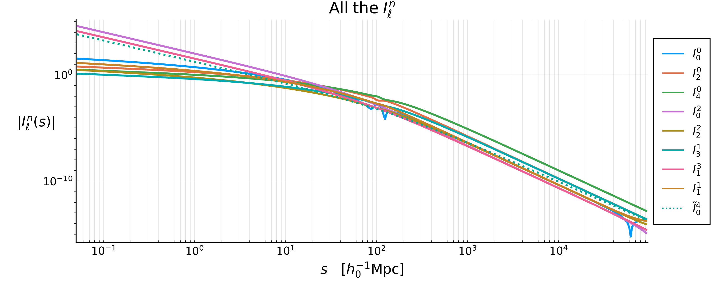
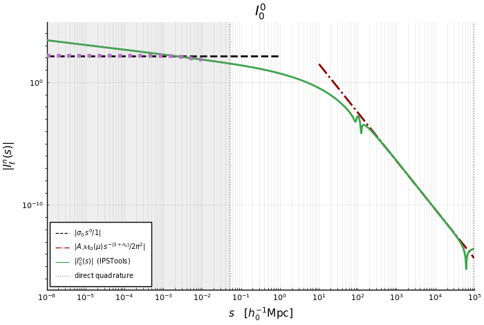
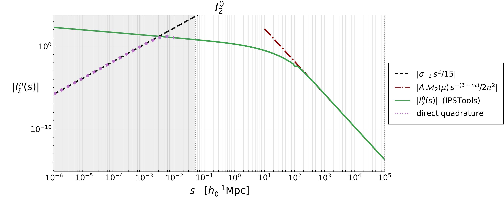
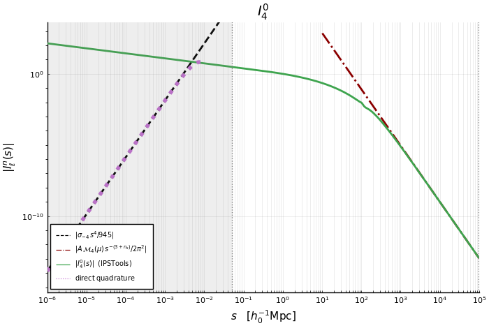
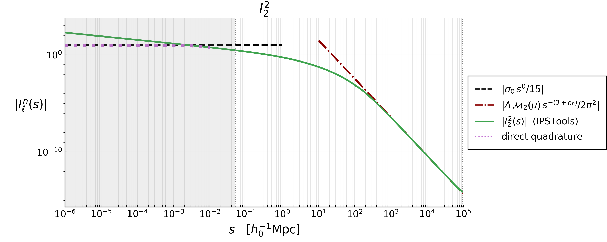
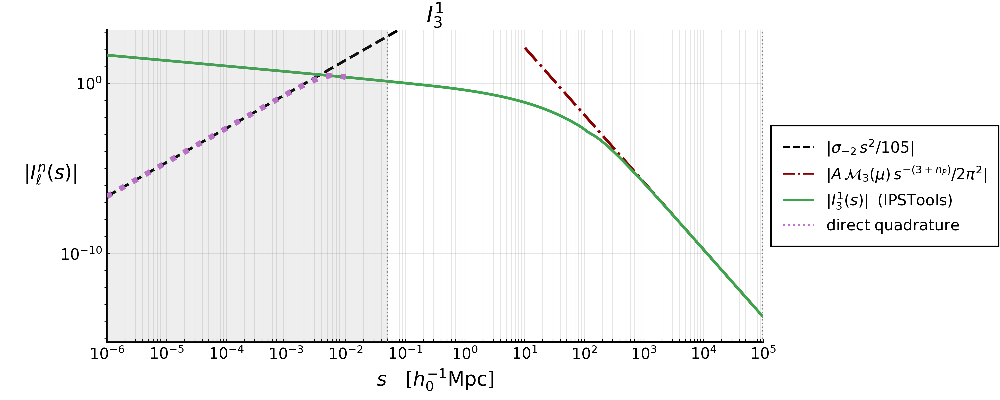
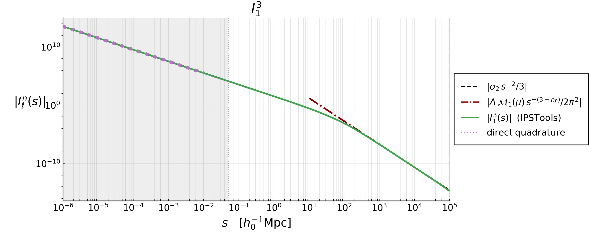
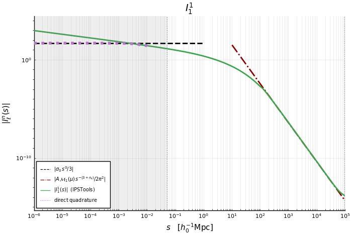
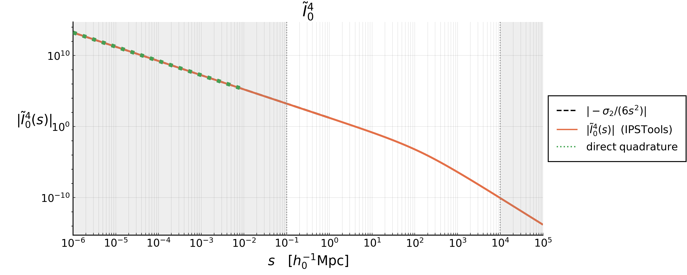

# The ``I_\ell^n`` integrals

- [The ``I_\ell^n`` integrals](#the-i_elln-integrals)
  - [Definitions](#definitions)
  - [TLDR; the easy-to-get small-``s`` behaviour](#tldr-the-easy-to-get-small-s-behaviour)
  - [The exact small-``s`` behaviour](#the-exact-small-s-behaviour)
    - [The three regimes](#the-three-regimes)
  - [The plots](#the-plots)
    - [One by one](#one-by-one)
  - [Reproducing the figures](#reproducing-the-figures)


Every Two-Point Correlation Function (TPCF) that GaPSE computes is, in the end, a sum of
terms of the form ``J(\chi, s, y) \, I_\ell^n(\Delta\chi)``. This page collects the
definition of these ``I_\ell^n``, proves their behaviour for small separations, and shows
what they look like.

The plots are produced by the script `theory/Iln_terms.jl` (or, equivalently, by the
notebook `theory/Iln_terms.ipynb`); see the end of this page.


## Definitions

The integrals are

```math
    I_\ell^n(s) := \int_0^{+\infty} \frac{\mathrm{d}q}{2\pi^2} \, q^2 \, P(q) \, \frac{j_\ell(qs)}{(qs)^n} \;, \quad \quad (1)
```

with ``P(q)`` the matter Power Spectrum at ``z=0`` stored inside the `Cosmology`, and
``j_\ell`` the spherical Bessel function of order ``\ell``. The eight combinations
``(\ell, n)`` that appear in the code are

```math
    (0,0) \, , \quad (2,0) \, , \quad (4,0) \, , \quad (0,2) \, , \quad
    (2,2) \, , \quad (3,1) \, , \quad (1,3) \, , \quad (1,1) \; ,
```

and they are stored in `IPSTools` as `I00`, `I20`, `I40`, `I02`, `I22`, `I31`, `I13` and
`I11` respectively, i.e. the name is `I` followed by ``\ell`` and then ``n``. Alongside
them there is the auxiliary integral

```math
\begin{align*}
    \tilde{I}_0^4(s) &:= \int_0^{+\infty} \frac{\mathrm{d}q}{2\pi^2} \, q^2 \, P(q) \, \frac{j_0(qs) - 1 }{(qs)^4} \quad \quad (2) \\[10pt]
        &= \frac{1}{s^4} \int_0^{+\infty} \frac{\mathrm{d}q}{2\pi^2} \, \frac{P(q)}{q^2} \, \left[ j_0(qs) - 1 \right] \; .
\end{align*}
```

stored in `IPSTools` as `I04_tilde` and computed by [`GaPSE.func_I04_tilde`](@ref).

We also need the moments of the Power Spectrum

```math
    \sigma_i := \int_{k_\mathrm{min}}^{k_\mathrm{max}} \frac{\mathrm{d}q}{2 \pi^2} \, q^{2-i} \, P(q) \; , \quad \quad (3)
```

of which `IPSTools` stores ``\sigma_0``, ``\sigma_1``, ``\sigma_2``, ``\sigma_3`` and
``\sigma_4``. Note that ``\sigma_i`` with ``i<0`` also appear below; they are perfectly
finite as long as ``k_\mathrm{max}`` is finite, but they are not stored, so the script
recomputes them when needed.


## TLDR; the easy-to-get small-``s`` behaviour


## The exact small-``s`` behaviour

```math
\boxed{
    I_\ell^n(s) \; \underset{s \rightarrow 0}{\sim}  \;
        \frac{\sigma_{n-\ell}}{(2\ell+1)!!} \, s^{\,\ell - n} 
}
\quad \quad (4a)
\qquad\qquad
\boxed{
    \tilde{I}_0^4(s) \; \underset{s \rightarrow 0}{\sim} \; - \frac{\sigma_2}{6 \, s^2}
}
\quad \quad (4b)
```

**Proof.** 

Acronym used for the sources:

- DLMF = Digital Library of Mathematical Functions
- NIST = National Institute of Standards and Technology


The Taylor series of the spherical Bessel function ``j_\ell(x)`` of order ``\ell`` is the following everywhere-convergent expansion (source: [U.S. NIST DLMF, Spherical Bessel Functions - Power Series, Section 10.53](https://dlmf.nist.gov/10.53) ):

```math
    j_\ell(x) = \sum_{k=0}^{+\infty} \frac{(-1)^k \, x^{\ell + 2k}}{2^k \, k! \, (2\ell + 2k + 1)!!} \; \quad \quad (5)\\[10pt]

 \quad n!! := \begin{cases} 
    2 \cdot 4 \cdot 6 \cdot ... \cdot n & n \mathrm{\; is \; even} \\
    1 \cdot 3 \cdot 5 \cdot ... \cdot n & n \mathrm{\; is \; odd}  \\
    1                                   & n=0,-1
\end{cases} 

```

We can set ``x = qs`` and divide both terms by ``(qs)^n``:

```math
    x:=qs \; \Rightarrow \;  \frac{(5)}{(qs)^n} : \quad \quad
    \frac{j_\ell(qs)}{(qs)^n} = \sum_{k=0}^{+\infty} \frac{(-1)^k \, (qs)^{\ell + 2k - n}}
        {2^k \, k! \, (2\ell + 2k + 1)!!} \; . \quad \quad (6)
```

We then insert this last Eq.(6) into the definition of ``I_\ell^n`` integrals Eq.(1), we bring the sum outside the integral (which is legitimate because the series converges uniformly on the compact integration range ``[k_\mathrm{min}, k_\mathrm{max}]``) and we insert the definition of ``\sigma_i`` Eq.(3):


```math
\begin{align*}
     (1): \quad \quad I_\ell^n(s) 
    &:= \int_0^{+\infty} \frac{\mathrm{d}q}{2\pi^2} \, q^2 \, P(q) \, \frac{j_\ell(qs)}{(qs)^n} \\[10pt]
    \mathrm{inserting\; } (6) \; \rightarrow \;\; \quad 
    &=  \int_0^{+\infty} \frac{\mathrm{d}q}{2\pi^2} \, q^2 \, P(q) \, 
        \sum_{k=0}^{+\infty} \frac{(-1)^k \, (qs)^{\ell + 2k - n}}
        {2^k \, k! \, (2\ell + 2k + 1)!!}  \\[10pt]
    &= \sum_{k=0}^{+\infty} \frac{(-1)^k \; s^{\ell + 2k - n}}
        {2^k \, k! \, (2\ell + 2k + 1)!!}
        \int \frac{\mathrm{d}q}{2\pi^2} \, q^{\,2 - (n - \ell - 2k)} \, P(q) \; \\[10pt]
    \mathrm{inserting\; } (3) \; \rightarrow \;\; \quad 
    &= \sum_{k=0}^{+\infty} \frac{(-1)^k \; \sigma_{n - \ell - 2k}}
        {2^k \, k! \, (2\ell + 2k + 1)!!} \; s^{\,\ell + 2k - n} \; . \quad \quad (7)
\end{align*}
```


Every term carries two more powers of ``s`` than the previous one, so for
``s \rightarrow 0`` the ``k=0`` term dominates, which is the claimed result:

```math
\begin{align*}
(7):\quad\quad I_\ell^n(s) &= \sum_{k=0}^{+\infty} \frac{(-1)^k \; \sigma_{n - \ell - 2k}}
        {2^k \, k! \, (2\ell + 2k + 1)!!} \; s^{\,\ell + 2k - n} \\[10pt]
    &= s^{\,\ell - n} \left[
        \frac{\sigma_{n-\ell}}{(2\ell+1)!!}  + 
        \sum_{k=1}^{+\infty} \frac{(-1)^k \; \sigma_{n - \ell - 2k}}
        {2^k \, k! \, (2\ell + 2k + 1)!!} \; s^{2k}\right]\\[10pt]
    &= \frac{\sigma_{n-\ell}}{(2\ell+1)!!} s^{\,\ell - n}
        \left[1 + \alpha_1 s^2 + \alpha_2 s^4 + ...\right]\\[10pt]
    &\underset{s \rightarrow 0}{\sim} \frac{\sigma_{n-\ell}}{(2\ell+1)!!} s^{\,\ell - n} \; . \quad\quad (8)
\end{align*}
```


For ``\tilde{I}_0^4`` the same argument applies to ``j_0(x) - 1``, whose series starts at
``k=1``:

```math
\begin{align*}
    (5) \mathrm{\;with\;}\ell=0 : \quad \quad 
    j_0(x) &= \sum_{k=0}^{+\infty} \frac{(-1)^k \, x^{2k}}{2^k \, k! \, (2k + 1)!!}\; \\[10pt]
        &= 1+\sum_{k=1}^{+\infty} \frac{(-1)^k \, x^{2k}}{2^k \, k! \, (2k + 1)!!} \\[10pt]
    2^k \, k! \, (2k+1)!! = (2k+1)! \; \rightarrow \quad \quad
        &= 1+\sum_{k=1}^{+\infty} \frac{(-1)^k \, x^{2k}}{(2k+1)!}
\end{align*}
```
```math
\Rightarrow \quad \quad j_0(x) -1 = \sum_{k=1}^{+\infty} \frac{(-1)^k \, x^{2k}}{(2k+1)!} \quad \quad (9)
```

Then

```math
\begin{align*}
    (2): \quad \quad \tilde{I}_0^4(s) 
        &= \frac{1}{s^4} \int_0^{+\infty} \frac{\mathrm{d}q}{2\pi^2} \, \frac{P(q)}{q^2} \, \left[ j_0(qs) - 1 \right] \; \\[10pt]
    \mathrm{inserting\; } (9) \; \rightarrow \;\; \quad
        &= \frac{1}{s^4} \int_0^{+\infty} \frac{\mathrm{d}q}{2\pi^2} \, \frac{P(q)}{q^2}
        \sum_{k=1}^{+\infty} \frac{(-1)^k \, (qs)^{2k}}{(2k+1)!}\\[10pt]
        &= \frac{1}{s^4} \sum_{k=1}^{+\infty} \frac{(-1)^k \, s^{2k}}{(2k+1)!}
        \int_0^{+\infty} \frac{\mathrm{d}q}{2\pi^2} \, q^{\,2k-2} \, P(q)\\[10pt]
        &= \sum_{k=1}^{+\infty} \frac{(-1)^k}{(2k+1)!}s^{2k-4}
        \int_0^{+\infty} \frac{\mathrm{d}q}{2\pi^2} \, q^{2-(4-2k)} \, P(q)\\[10pt]
    \mathrm{inserting\; } (3) \; \rightarrow \;\; \quad 
        &=\sum_{k=1}^{+\infty} \frac{(-1)^k \, \sigma_{4-2k}}{(2k+1)!} \, s^{\,2k-4} \; ,
        \quad\quad (10)
\end{align*}

```

And analogously, every term carries two more powers of ``s`` than the previous one, so for
``s \rightarrow 0`` the ``k=1`` term dominates, which is again the claimed result:

```math
\begin{align*}
(10):\quad\quad \tilde{I}_0^4(s) &= \sum_{k=1}^{+\infty} \frac{(-1)^k \, \sigma_{4-2k}}{(2k+1)!} \, s^{\,2k-4} \\[10pt]
    &= s^{-2} \left[
        \sum_{k=1}^{+\infty} \frac{(-1)^k \; \sigma_{4 - 2k}}
        {(2k + 1)!} \; s^{2k-2}\right]\\[10pt]
    &= s^{-2} \left[
        - \frac{\sigma_{2}}{3!} + \frac{\sigma_0}{5!}s^2 - \frac{\sigma_{-2}}{7!}s^4 +...
        \right]\\[10pt]
    &= - \frac{\sigma_{2}}{6} s^{-2} + \frac{\sigma_0}{120} - \frac{\sigma_{-2}}{5040} s^2 + ... \\[10pt]
    &\underset{s \rightarrow 0}{\sim} - \frac{\sigma_{2}}{6\,s^2} \; . \quad\quad (11)
\end{align*}
```


### The three regimes

The sign of ``\ell - n`` decides everything:

```math
I_\ell^n \xrightarrow[s \rightarrow 0]{} 
\begin{cases}
\propto s^{\ell-n} \rightarrow 0                    & \ell > n \\[10pt]
\frac{\sigma_0}{(2\ell+1)!!}                        & \ell = n \\[10pt]
\propto \frac{1}{s^{n-\ell}} \rightarrow +\infty    & \ell < n
\end{cases} 
```


|                         |  ``\ell``   |    ``n``    | ``s \rightarrow 0``                | limit       |
| :---------------------- | :---------: | :---------: | :--------------------------------- | :---------- |
| ``\, I_0^0 \,``         | ``\, 0 \,`` | ``\, 0 \,`` | ``\sigma_0``                       | const       |
| ``\, I_2^0 \,``         | ``\, 2 \,`` | ``\, 0 \,`` | ``\frac{\sigma_{-2}}{15} \, s^2 `` | ``0``       |
| ``\, I_4^0 \,``         | ``\, 4 \,`` | ``\, 0 \,`` | ``\frac{\sigma_{-4}}{945} \, s^4`` | ``0``       |
| ``\, I_0^2 \,``         | ``\, 0 \,`` | ``\, 2 \,`` | ``\sigma_2 \, s^{-2}``             | ``+\infty`` |
| ``\, I_2^2 \,``         | ``\, 2 \,`` | ``\, 2 \,`` | ``\frac{\sigma_0}{15}``            | const       |
| ``\, I_3^1 \,``         | ``\, 3 \,`` | ``\, 1 \,`` | ``\frac{\sigma_{-2}}{105} \, s^2`` | ``0``       |
| ``\, I_1^3 \,``         | ``\, 1 \,`` | ``\, 3 \,`` | ``\frac{\sigma_2}{3 \, s^{-2}}``   | ``+\infty`` |
| ``\, I_1^1 \,``         | ``\, 1 \,`` | ``\, 1 \,`` | ``\frac{\sigma_0}{3}``             | const       |
| ``\, \tilde{I}_0^4 \,`` |      -      |      -      | ``-\frac{\sigma_2}{6}\, s^{-2}``   | ``+\infty`` |

The diverging ones are never a problem in practice: inside a TPCF they always come
multiplied by a ``J`` carrying the matching positive power of ``\Delta\chi``, so that the
product stays finite. How the cancellation works, term by term and for every TPCF, is the
subject of "The ``\Delta\chi \rightarrow 0`` limits" page.

## The plots

All the curves show ``|I_\ell^n(s)|`` rather than ``I_\ell^n(s)``: these integrals
oscillate and change sign at large ``s``, where a logarithmic vertical axis would not be
defined. At small ``s``, the regime this page is about, they keep a constant sign, so the
absolute value is immaterial there and the asymptote (dashed, black) can be read off
directly.

```math
\boxed{
    I_\ell^n(s) \; \underset{s \rightarrow 0}{\sim}  \;
        \frac{\sigma_{n-\ell}}{(2\ell+1)!!} \, s^{\,\ell - n} 
}
\quad \quad (4a)
\qquad\qquad
\boxed{
    \tilde{I}_0^4(s) \; \underset{s \rightarrow 0}{\sim} \; - \frac{\sigma_2}{6 \, s^2}
}
\quad \quad (4b)
```




The three regimes are visible at a glance: the curves that flatten out
(``\ell = n``), the ones that fall off as a power law (``\ell > n``) and the ones that
blow up (``\ell < n``).

### One by one

|                                              |                                  |
| :------------------------------------------: | :------------------------------: |
|              |  |
|              |  |
|              |  |
|              |  |
|  |                                  |

## Reproducing the figures

The figures are not built by the documentation: they are committed under
`docs/src/assets/Iln_terms/`, and regenerated on demand by the script in the `theory/`
directory. From `theory/`, after the one-time setup described in its `README.md`:

```bash
$ julia --project=. Iln_terms.jl
```

which writes the plots and a table of the numerical values in `theory/Iln_terms/`, and,
since `SAVE_TO_DOCS = true`, also refreshes the copies used by this page. The same
computation is available step by step in the notebook `theory/Iln_terms.ipynb`.

See also: [`GaPSE.IPSTools`](@ref), [`GaPSE.IntegralIPS`](@ref),
[`GaPSE.func_I04_tilde`](@ref).
