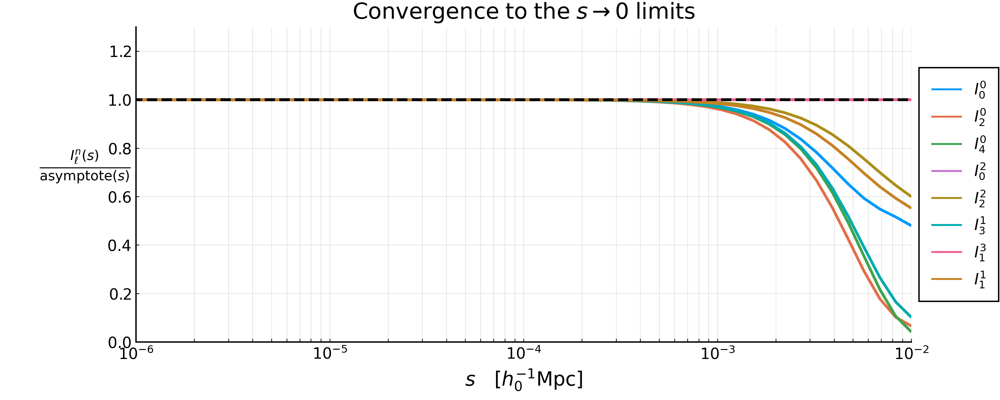
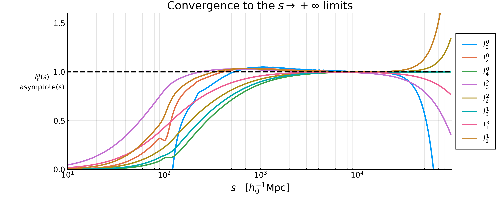

# The ``I_\ell^n`` integrals

- [The ``I_\ell^n`` integrals](#the-i_elln-integrals)
  - [Definitions](#definitions)
  - [TLDR; the easy-to-get small-``s`` behaviour](#tldr-the-easy-to-get-small-s-behaviour)
  - [The exact small-``s`` behaviour](#the-exact-small-s-behaviour)
    - [The three regimes](#the-three-regimes)
  - [A warning before looking at the plots](#a-warning-before-looking-at-the-plots)
    - [1. An `IntegralIPS` is a spline only between `left` and `right`](#1-an-integralips-is-a-spline-only-between-left-and-right)
    - [2. The ``\sigma_i`` must use the same ``k`` extremes as the ``I_\ell^n``](#2-the-sigma_i-must-use-the-same-k-extremes-as-the-i_elln)
    - [3. The asymptotic regime starts below ``1/k_\mathrm{max}``](#3-the-asymptotic-regime-starts-below-1k_mathrmmax)
  - [The plots](#the-plots)
    - [One by one](#one-by-one)
  - [The large-``s`` behaviour](#the-large-s-behaviour)
    - [The small-``k`` slope of the matter Power Spectrum](#the-small-k-slope-of-the-matter-power-spectrum)
    - [Why the limit cannot be taken inside the integral](#why-the-limit-cannot-be-taken-inside-the-integral)
    - [The proof, by Mellin transform](#the-proof-by-mellin-transform)
    - [The check](#the-check)
    - [Where it stops holding](#where-it-stops-holding)
    - [Why ``\tilde{I}_0^4`` is excluded](#why-tildei_04-is-excluded)
  - [Reproducing the figures](#reproducing-the-figures)


Every Two-Point Correlation Function (TPCF) that GaPSE computes is, in the end, a sum of
terms of the form ``J(\chi, s, y) \, I_\ell^n(\Delta\chi)``. This page collects the
definition of these ``I_\ell^n``, proves their behaviour for small separations, and shows
what they look like.

The plots are produced by the script `theory/Iln_terms.jl` (or, equivalently, by the
notebook `theory/Iln_terms.ipynb`); see the end of this page.


## Definitions

The integrals are

```math
    I_\ell^n(s) := \int_0^{+\infty} \frac{\mathrm{d}q}{2\pi^2} \, q^2 \, P(q) \, \frac{j_\ell(qs)}{(qs)^n} \;, \quad \quad (1)
```

with ``P(q)`` the matter Power Spectrum at ``z=0`` stored inside the `Cosmology`, and
``j_\ell`` the spherical Bessel function of order ``\ell``. The eight combinations
``(\ell, n)`` that appear in the code are

```math
    (0,0) \, , \quad (2,0) \, , \quad (4,0) \, , \quad (0,2) \, , \quad
    (2,2) \, , \quad (3,1) \, , \quad (1,3) \, , \quad (1,1) \; ,
```

and they are stored in `IPSTools` as `I00`, `I20`, `I40`, `I02`, `I22`, `I31`, `I13` and
`I11` respectively, i.e. the name is `I` followed by ``\ell`` and then ``n``. Alongside
them there is the auxiliary integral

```math
\begin{align*}
    \tilde{I}_0^4(s) &:= \int_0^{+\infty} \frac{\mathrm{d}q}{2\pi^2} \, q^2 \, P(q) \, \frac{j_0(qs) - 1 }{(qs)^4} \quad \quad (2) \\[10pt]
        &= \frac{1}{s^4} \int_0^{+\infty} \frac{\mathrm{d}q}{2\pi^2} \, \frac{P(q)}{q^2} \, \left[ j_0(qs) - 1 \right] \; .
\end{align*}
```

stored in `IPSTools` as `I04_tilde` and computed by [`GaPSE.func_I04_tilde`](@ref).

We also need the moments of the Power Spectrum

```math
    \sigma_i := \int_{k_\mathrm{min}}^{k_\mathrm{max}} \frac{\mathrm{d}q}{2 \pi^2} \, q^{2-i} \, P(q) \; , \quad \quad (3)
```

of which `IPSTools` stores ``\sigma_0``, ``\sigma_1``, ``\sigma_2``, ``\sigma_3`` and
``\sigma_4``. Note that ``\sigma_i`` with ``i<0`` also appear below; they are perfectly
finite as long as ``k_\mathrm{max}`` is finite, but they are not stored, so the script
recomputes them when needed.


## TLDR; the easy-to-get small-``s`` behaviour


```math
\begin{align*}
j_\ell(x) \mathrm{ \; series \; expansion \; near \; 0}&: \quad \quad  
    j_\ell(x) = x^\ell \left( 
        \frac{\sqrt{\pi}}{2^{\ell+1}\, 
        \Gamma(\ell + 3/2)} + O(x^2)
    \right) \quad \quad \mathrm{(1.1)}\\[10pt]
\Rightarrow j_\ell(x) \; &\underset{x \rightarrow 0}{\sim}  x^{\ell}
\quad \quad \mathrm{(1.2)}
\end{align*}
```

So:

```math
\begin{align*}
    (1): \quad \quad I_\ell^n(s) 
    &:= \int_0^{+\infty} \frac{\mathrm{d}q}{2\pi^2} \, q^2 \, P(q) \, \frac{j_\ell(qs)}{(qs)^n} \\[10pt]
    \mathrm{inserting\; (1.2) }  \; \rightarrow \;\; \quad
    &\underset{s \rightarrow 0}{\sim} \int_0^{+\infty} \frac{\mathrm{d}q}{2\pi^2} \, q^2 \, P(q) \, \frac{(qs)^{\ell}}{(qs)^n}\\[10pt] 
    &=  s^{\ell-n}\int_0^{+\infty} \frac{\mathrm{d}q}{2\pi^2} \, q^{2-(n-\ell)} \, P(q) \, \\[10pt]
    &= \sigma_{n-\ell} \; s^{\ell-n}\\[10pt]
    &\underset{s \rightarrow 0}{\sim} s^{\ell-n}
\end{align*}
```


## The exact small-``s`` behaviour

```math
\boxed{
    I_\ell^n(s) \; \underset{s \rightarrow 0}{\sim}  \;
        \frac{\sigma_{n-\ell}}{(2\ell+1)!!} \, s^{\,\ell - n} 
}
\quad \quad (4a)
\qquad\qquad
\boxed{
    \tilde{I}_0^4(s) \; \underset{s \rightarrow 0}{\sim} \; - \frac{\sigma_2}{6 \, s^2}
}
\quad \quad (4b)
```

**Proof.** 

Acronym used for the sources:

- DLMF = Digital Library of Mathematical Functions
- NIST = National Institute of Standards and Technology


The Taylor series of the spherical Bessel function ``j_\ell(x)`` of order ``\ell`` is the following everywhere-convergent expansion (source: [U.S. NIST DLMF, Spherical Bessel Functions - Power Series, Section 10.53](https://dlmf.nist.gov/10.53) ):

```math
    j_\ell(x) = \sum_{k=0}^{+\infty} \frac{(-1)^k \, x^{\ell + 2k}}{2^k \, k! \, (2\ell + 2k + 1)!!} \; \quad \quad (2.1)\\[10pt]

 \quad n!! := \begin{cases} 
    2 \cdot 4 \cdot 6 \cdot ... \cdot n & n \mathrm{\; is \; even} \\
    1 \cdot 3 \cdot 5 \cdot ... \cdot n & n \mathrm{\; is \; odd}  \\
    1                                   & n=0,-1
\end{cases} 

```

We can set ``x = qs`` and divide both terms by ``(qs)^n``:

```math
    x:=qs \; \Rightarrow \;  \frac{(2.1)}{(qs)^n} : \quad \quad
    \frac{j_\ell(qs)}{(qs)^n} = \sum_{k=0}^{+\infty} \frac{(-1)^k \, (qs)^{\ell + 2k - n}}
        {2^k \, k! \, (2\ell + 2k + 1)!!} \; . \quad \quad (2.2)
```

We then insert this last Eq.(2.2) into the definition of ``I_\ell^n`` integrals Eq.(1), we bring the sum outside the integral (which is legitimate because the series converges uniformly on the compact integration range ``[k_\mathrm{min}, k_\mathrm{max}]``) and we insert the definition of ``\sigma_i`` Eq.(3):


```math
\begin{align*}
     (1): \quad \quad I_\ell^n(s) 
    &:= \int_0^{+\infty} \frac{\mathrm{d}q}{2\pi^2} \, q^2 \, P(q) \, \frac{j_\ell(qs)}{(qs)^n} \\[10pt]
    \mathrm{inserting\; } (2.2) \; \rightarrow \;\; \quad 
    &=  \int_0^{+\infty} \frac{\mathrm{d}q}{2\pi^2} \, q^2 \, P(q) \, 
        \sum_{k=0}^{+\infty} \frac{(-1)^k \, (qs)^{\ell + 2k - n}}
        {2^k \, k! \, (2\ell + 2k + 1)!!}  \\[10pt]
    &= \sum_{k=0}^{+\infty} \frac{(-1)^k \; s^{\ell + 2k - n}}
        {2^k \, k! \, (2\ell + 2k + 1)!!}
        \int \frac{\mathrm{d}q}{2\pi^2} \, q^{\,2 - (n - \ell - 2k)} \, P(q) \; \\[10pt]
    \mathrm{inserting\; } (3) \; \rightarrow \;\; \quad 
    &= \sum_{k=0}^{+\infty} \frac{(-1)^k \; \sigma_{n - \ell - 2k}}
        {2^k \, k! \, (2\ell + 2k + 1)!!} \; s^{\,\ell + 2k - n} \; . \quad \quad (2.3)
\end{align*}
```


Every term carries two more powers of ``s`` than the previous one, so for
``s \rightarrow 0`` the ``k=0`` term dominates, which is the claimed result:

```math
\begin{align*}
(2.3):\quad\quad I_\ell^n(s) &= \sum_{k=0}^{+\infty} \frac{(-1)^k \; \sigma_{n - \ell - 2k}}
        {2^k \, k! \, (2\ell + 2k + 1)!!} \; s^{\,\ell + 2k - n} \\[10pt]
    &= s^{\,\ell - n} \left[
        \frac{\sigma_{n-\ell}}{(2\ell+1)!!}  + 
        \sum_{k=1}^{+\infty} \frac{(-1)^k \; \sigma_{n - \ell - 2k}}
        {2^k \, k! \, (2\ell + 2k + 1)!!} \; s^{2k}\right]\\[10pt]
    &= \frac{\sigma_{n-\ell}}{(2\ell+1)!!} s^{\,\ell - n}
        \left[1 + \alpha_1 s^2 + \alpha_2 s^4 + ...\right]\\[10pt]
    &\underset{s \rightarrow 0}{\sim} \frac{\sigma_{n-\ell}}{(2\ell+1)!!} s^{\,\ell - n} \; . \quad\quad (2.4)
\end{align*}
```


For ``\tilde{I}_0^4`` the same argument applies to ``j_0(x) - 1``, whose series starts at
``k=1``:

```math
\begin{align*}
    (2.1) \mathrm{\;with\;}\ell=0 : \quad \quad 
    j_0(x) &= \sum_{k=0}^{+\infty} \frac{(-1)^k \, x^{2k}}{2^k \, k! \, (2k + 1)!!}\; \\[10pt]
        &= 1+\sum_{k=1}^{+\infty} \frac{(-1)^k \, x^{2k}}{2^k \, k! \, (2k + 1)!!} \\[10pt]
    2^k \, k! \, (2k+1)!! = (2k+1)! \; \rightarrow \quad \quad
        &= 1+\sum_{k=1}^{+\infty} \frac{(-1)^k \, x^{2k}}{(2k+1)!}
\end{align*}
```
```math
\Rightarrow \quad \quad j_0(x) -1 = \sum_{k=1}^{+\infty} \frac{(-1)^k \, x^{2k}}{(2k+1)!} \quad \quad (2.5)
```

Then

```math
\begin{align*}
    (2): \quad \quad \tilde{I}_0^4(s) 
        &= \frac{1}{s^4} \int_0^{+\infty} \frac{\mathrm{d}q}{2\pi^2} \, \frac{P(q)}{q^2} \, \left[ j_0(qs) - 1 \right] \; \\[10pt]
    \mathrm{inserting\; } (2.6) \; \rightarrow \;\; \quad
        &= \frac{1}{s^4} \int_0^{+\infty} \frac{\mathrm{d}q}{2\pi^2} \, \frac{P(q)}{q^2}
        \sum_{k=1}^{+\infty} \frac{(-1)^k \, (qs)^{2k}}{(2k+1)!}\\[10pt]
        &= \frac{1}{s^4} \sum_{k=1}^{+\infty} \frac{(-1)^k \, s^{2k}}{(2k+1)!}
        \int_0^{+\infty} \frac{\mathrm{d}q}{2\pi^2} \, q^{\,2k-2} \, P(q)\\[10pt]
        &= \sum_{k=1}^{+\infty} \frac{(-1)^k}{(2k+1)!}s^{2k-4}
        \int_0^{+\infty} \frac{\mathrm{d}q}{2\pi^2} \, q^{2-(4-2k)} \, P(q)\\[10pt]
    \mathrm{inserting\; } (3) \; \rightarrow \;\; \quad 
        &=\sum_{k=1}^{+\infty} \frac{(-1)^k \, \sigma_{4-2k}}{(2k+1)!} \, s^{\,2k-4} \; ,
        \quad\quad (2.7)
\end{align*}

```

And analogously, every term carries two more powers of ``s`` than the previous one, so for
``s \rightarrow 0`` the ``k=1`` term dominates, which is again the claimed result:

```math
\begin{align*}
(2.7):\quad\quad \tilde{I}_0^4(s) &= \sum_{k=1}^{+\infty} \frac{(-1)^k \, \sigma_{4-2k}}{(2k+1)!} \, s^{\,2k-4} \\[10pt]
    &= s^{-2} \left[
        \sum_{k=1}^{+\infty} \frac{(-1)^k \; \sigma_{4 - 2k}}
        {(2k + 1)!} \; s^{2k-2}\right]\\[10pt]
    &= s^{-2} \left[
        - \frac{\sigma_{2}}{3!} + \frac{\sigma_0}{5!}s^2 - \frac{\sigma_{-2}}{7!}s^4 +...
        \right]\\[10pt]
    &= - \frac{\sigma_{2}}{6} s^{-2} + \frac{\sigma_0}{120} - \frac{\sigma_{-2}}{5040} s^2 + ... \\[10pt]
    &\underset{s \rightarrow 0}{\sim} - \frac{\sigma_{2}}{6\,s^2} \; . \quad\quad (2.8)
\end{align*}
```


### The three regimes

The sign of ``\ell - n`` decides everything:

```math
I_\ell^n \xrightarrow[s \rightarrow 0]{} 
\begin{cases}
\propto s^{\ell-n} \rightarrow 0                    & \ell > n \\[10pt]
\frac{\sigma_0}{(2\ell+1)!!}                        & \ell = n  \quad \quad (5) \\[10pt]
\propto \frac{1}{s^{n-\ell}} \rightarrow +\infty    & \ell < n
\end{cases} 
```

So, written explicitly:


```math
\begin{align*}
I_0^0           &\sim \sigma_0                         &&\rightarrow \mathrm{const} \quad\quad\quad
    &I_2^2           &\sim \frac{\sigma_0}{15}              &&\rightarrow \mathrm{const} \\[10pt]
I_2^0           &\sim \frac{\sigma_{-2}}{15} \, s^2    &&\rightarrow 0              
    & I_3^1          &\sim \frac{\sigma_{-2}}{105} \, s^2   &&\rightarrow 0              \\[10pt]
I_4^0           &\sim \frac{\sigma_{-4}}{945} \, s^4   &&\rightarrow 0              
    &I_1^3           &\sim \frac{\sigma_2}{3} \, s^{-2}     &&\rightarrow +\infty        \\[10pt]
I_0^2           &\sim \sigma_2 \, s^{-2}               &&\rightarrow +\infty        
    &I_1^1           &\sim \frac{\sigma_0}{3}               &&\rightarrow \mathrm{const} \\[10pt]
\end{align*}
```

```math
\tilde{I}_0^4   \sim -\frac{\sigma_2}{6}\, s^{-2}     \rightarrow +\infty\\[10pt]
```


The diverging ones are never a problem in practice: inside a TPCF they always come
multiplied by a ``J`` carrying the matching positive power of ``\Delta\chi``, so that the
product stays finite. How the cancellation works, term by term and for every TPCF, is the
subject of "The ``\Delta\chi \rightarrow 0`` limits" page.

## A warning before looking at the plots

Everything above is exact. What `IPSTools` gives you, however, is **not** the integral
everywhere, and a naive plot of it down to ``s = 10^{-4}`` looks nothing like (4a).
Three distinct things have to be kept in mind.

### 1. An `IntegralIPS` is a spline only between `left` and `right`

Each ``I_\ell^n`` is stored as a [`GaPSE.IntegralIPS`](@ref), which evaluates as

```math
I_\ell^n(s) =
\begin{cases}
a_\mathrm{L} + b_\mathrm{L} \, s^{\,s_\mathrm{L}} \; ,  & s < \mathrm{left} \\[6pt]
\mathrm{spline}(s) \; ,  & \mathrm{left} \leq s \leq \mathrm{right} \\[6pt]
a_\mathrm{R} + b_\mathrm{R} \, s^{\,s_\mathrm{R}} \; ,  & s > \mathrm{right}
\end{cases}
```

with ``\mathrm{left} = \mathrm{fit\_min} = 0.05 \, h_0^{-1}\mathrm{Mpc}`` for all the
``I_\ell^n`` (and ``0.1`` for ``\tilde{I}_0^4``). The coefficients
``a_\mathrm{L}, b_\mathrm{L}, s_\mathrm{L}`` are fitted on
``[\mathrm{fit\_min}, \mathrm{fit\_max}] = [0.05, 0.5]``, i.e. on a region that is still
very far from the asymptotic one, and the fit is seeded with a *negative* exponent.
The consequence is that, with this input Power Spectrum, below ``s = 0.05``
**every** ``I_\ell^n`` comes out with a negative fitted exponent and diverges, whatever
its true behaviour. This is not a bug — GaPSE never evaluates
them there — but it does mean that the region ``s < 0.05`` of any plot of an
`IntegralIPS` carries no information about the limits derived above. In the figures
below it is shaded in grey.

### 2. The ``\sigma_i`` must use the same ``k`` extremes as the ``I_\ell^n``

`IPSTools` hard-codes ``k_\mathrm{min}, k_\mathrm{max} = 10^{-5}, 10^{3}`` for the
`xicalc` call that builds the ``I_\ell^n``, regardless of the `k_min`/`k_max` keywords,
which are only used for the ``\sigma_i`` it stores. Comparing an ``I_\ell^n`` with an
asymptote built out of ``\sigma_i`` computed over a different range is meaningless,
because the ``\sigma_i`` with negative index are completely dominated by their upper
extreme: with ``P(q) \propto q^{-2.64}`` at large ``q``, the integrand of
``\sigma_{-2}`` grows as ``q^{1.36}`` and that of ``\sigma_{-4}`` as ``q^{3.36}``. For
`data/WideA_ZA_pk.dat`:

| ``i``  | over ``[10^{-6}, 10]`` | over ``[10^{-5}, 10^{3}]`` |                 ratio |
| :----: | ---------------------: | -------------------------: | --------------------: |
| ``0``  |              ``18.58`` |                  ``143.3`` |               ``7.7`` |
| ``2``  |             ``101.06`` |                 ``101.13`` |             ``1.001`` |
| ``-2`` |              ``437.8`` |     ``2.35 \times 10^{7}`` | ``5.4 \times 10^{4}`` |
| ``-4`` | ``2.41 \times 10^{4}`` |    ``1.27 \times 10^{13}`` | ``5.3 \times 10^{8}`` |

Only ``\sigma_2`` is insensitive to the choice, which is exactly why ``I_0^2``,
``I_1^3`` and ``\tilde{I}_0^4`` — the three whose limits depend on ``\sigma_2`` alone —
are the only ones that appear to obey (4a) even when the extremes are mismatched.

### 3. The asymptotic regime starts below ``1/k_\mathrm{max}``

Truncating the series at ``k = 0`` requires ``(qs)^2 \ll 1`` for every ``q`` that
carries weight in the integral, i.e.

```math
s \; \ll \; \frac{1}{k_\mathrm{max}} = 10^{-3} \; h_0^{-1}\mathrm{Mpc} \; .
```

This is 50 times *smaller* than ``\mathrm{fit\_min} = 0.05``, so the window where the
limits hold and the window where the spline is valid **do not overlap**. The limits are
therefore not observable through `IPSTools`: to see them one has to compute the integrals
directly, which is what the `I_direct` function of `theory/Iln_terms.jl` does.

Doing so confirms (4a) to four digits. Calling ``R_\ell^n(s)`` the ratio between the
directly-computed integral and its asymptote:

| ``s``       | ``R_0^0`` | ``R_2^0`` | ``R_4^0`` | ``R_0^2`` | ``R_2^2`` | ``R_3^1`` | ``R_1^3`` | ``R_1^1`` |
| :---------- | --------: | --------: | --------: | --------: | --------: | --------: | --------: | --------: |
| ``10^{-5}`` |    1.0000 |    1.0000 |    1.0000 |    1.0000 |    1.0000 |    1.0000 |    1.0000 |    1.0000 |
| ``10^{-4}`` |    0.9997 |    0.9996 |    0.9997 |    1.0000 |    0.9999 |    0.9997 |    1.0000 |    0.9998 |
| ``10^{-3}`` |    0.9734 |    0.9621 |    0.9693 |    1.0000 |    0.9885 |    0.9704 |    1.0000 |    0.9839 |
| ``10^{-2}`` |    0.4799 |    0.0661 |    0.0416 |    1.0000 |    0.5997 |    0.1018 |    1.0000 |    0.5521 |
| ``0.05``    |    0.2337 |    0.0015 |    0.0000 |    0.9998 |    0.3033 |    0.0023 |    0.9999 |    0.2760 |



The three ``\sigma_2``-only columns sit at 1 over the whole range, for the reason given
in the previous point: their integrand ``q^2 P(q) \, j_\ell(qs)/(qs)^n`` is weighted so
that only ``q \ll 1/s`` contributes, so the expansion is never actually stressed. All
the others peel off from 1 exactly where ``s`` approaches ``1/k_\mathrm{max}``.

## The plots

All the curves show ``|I_\ell^n(s)|`` rather than ``I_\ell^n(s)``: these integrals
oscillate and change sign at large ``s``, where a logarithmic vertical axis would not be
defined. At small ``s``, the regime this page is about, they keep a constant sign, so the
absolute value is immaterial there and the asymptote (dashed, black) can be read off
directly.

Each of the individual figures carries four things: the `IntegralIPS` stored in
`IPSTools` (solid), the direct quadrature for ``s \leq 10^{-2}`` (dotted), the analytic
asymptote (dashed, black), and two grey bands marking where the `IntegralIPS` is a
power-law extrapolation rather than the integral. The combined figure below is instead
restricted to ``[\mathrm{left}, \mathrm{right}]``, where all of them are genuine splines.

```math
\boxed{
    I_\ell^n(s) \; \underset{s \rightarrow 0}{\sim}  \;
        \frac{\sigma_{n-\ell}}{(2\ell+1)!!} \, s^{\,\ell - n} 
}
\quad \quad (4a)
\qquad\qquad
\boxed{
    \tilde{I}_0^4(s) \; \underset{s \rightarrow 0}{\sim} \; - \frac{\sigma_2}{6 \, s^2}
}
\quad \quad (4b)
```


The three regimes are visible at a glance: the curves that flatten out
(``\ell = n``), the ones that fall off as a power law (``\ell > n``) and the ones that
blow up (``\ell < n``).

### One by one

|                                              |                                  |
| :------------------------------------------: | :------------------------------: |
|              |  |
|              |  |
|              |  |
|              |  |
|  |                                  |

## The large-``s`` behaviour

The opposite end has a pleasant surprise: **the exponent is the same for every ``\ell``
and every ``n``**. Getting there, however, needs more care than the ``s \rightarrow 0``
side, because the obvious route does not work.

### The small-``k`` slope of the matter Power Spectrum

In the ``\Lambda``-CDM cosmology, the primordial curvature perturbations are a pure power law (see the [Planck 2018 results, A&A 641, A10 (2020)](https://doi.org/10.1051/0004-6361/201833887)), usually quoted through the dimensionless power spectrum ``\Delta^2_{\mathcal{R}}``:

```math
    \Delta^2_{\mathcal{R}}(k) := \frac{k^3}{2\pi^2} P_\mathcal{R}(k) \quad \quad (3.1)
```

```math
\begin{align*}
    \Delta^2_{\mathcal{R}}(k) &\underset{k \rightarrow 0^{+}}{\sim} \; A_s \, \left( \frac{k}{k^*}\right)^{n_s-1} &&(3.2)\\[10pt]

    n_s&\approx 0.965&&\mathrm{primordial \; spectral \; index}\\[8pt]
    \ln(10^{10} A_s) &\approx 3.043 &&\mathrm{ log \; power \; of \; primordial \; curvature \; perturbations} \Rightarrow A_s \approx 2.1 \times 10^{-9}\\[8pt]
    k^* &\approx 0.05 \; h\,\mathrm{Mpc}^{-1}  &&\mathrm{arbitrary \; pivot \; scale}
\end{align*}
```

```math
    \Rightarrow P_\mathcal{R}(k) = \frac{2\pi^2}{k^3}\,\Delta^2_{\mathcal{R}}(k) \underset{k \rightarrow 0^{+}}{\sim} k^{\,n_s-4} \quad \quad (3.3) \\[10pt]
```

What enters the ``I_\ell^n`` is the matter Power Spectrum ``P_m(k,z)`` at present day (``z=0``), a dimensional quantity in ``(h^{-1}\mathrm{Mpc})^3``. The two are related by the Poisson equation and the transfer function ``T(k)``:

```math
    P_m(k, z)  \propto  k^4 \, T^2(k) \, D^2(z) \, P_\mathcal{R}(k)
    \quad \quad (3.4)
```

The transfer function is normalized such that at large scales it goes to ``1``: 
```math
    T(k) \xrightarrow[k \rightarrow 0^{+}]{} 1 \quad \quad (3.5) \\[10pt]
```

so at present day:

```math
\begin{align*}
    (3.4)\; \mathrm{with} \; z=0 : \quad \quad P_m(k, z=0)  & \propto  k^4 \, T^2(k) \, D^2(0) \, P_\mathcal{R}(k)\\[10pt]
    \mathrm{Inserting} \; (3.5) \rightarrow  \quad \quad
    &\underset{ k\rightarrow 0^{+}}{\sim} \; k^{4}  \; P_\mathcal{R}(k) \\[10pt]
    \mathrm{Inserting} \; (3.3) \rightarrow  \quad \quad
    &\underset{ k\rightarrow 0^{+}}{\sim} \; k^{4}  \, k^{\,n_s-4}  \\[10pt]
    &= \; k^{n_s}\\[10pt]
\end{align*}
```

```math
    \quad \Rightarrow \quad
    P(k) \; \underset{k \rightarrow 0^{+}}{\sim}  \, k^{n_s} \; ,
    \quad \quad n_s \simeq 0.96
    \quad \quad (3.6)
```

The matter Power Spectrum therefore *grows* as ``k^{+0.96}`` at small ``k``. The
dimensionless curvature goes as ``k^{n_s-1} \simeq k^{-0.035}`` and the four
powers of ``k`` supplied by Poisson, minus the three of the
``\Delta^2 \leftrightarrow P`` conversion, are exactly what separates them.

NOTE: this is directly visible in `data/WideA_ZA_pk.dat`, whose local slope
``\mathrm{d}\ln P / \mathrm{d}\ln k`` is ``+0.9600`` for ``k \in [10^{-6}, 10^{-5}]`` and
still ``+0.9599`` for ``k \in [10^{-5}, 10^{-4}]``, with an amplitude of order
``10^{6} \, (h^{-1}\mathrm{Mpc})^3``.


### Why the limit cannot be taken inside the integral

The tempting move is to substitute ``q`` with ``x := q s`` in Eq.(1),

```math
x:=qs \quad \Rightarrow \quad q = \frac{x}{s} \quad \Rightarrow \quad \mathrm{d}q = \frac{\mathrm{d}x}{s} \quad \quad (3.4)
```

so that

```math
\begin{align*}
     (1): \quad \quad I_\ell^n(s)
    &:= \int_0^{+\infty} \frac{\mathrm{d}q}{2\pi^2} \, q^2 \, P(q) \, \frac{j_\ell(qs)}{(qs)^n} \\[10pt]
    \mathrm{inserting \; (3.4)} \; \rightarrow \;\; \quad
    &=  \int_0^{+\infty} \frac{\mathrm{d}x}{2 \pi^2 s} \, \frac{x^2}{s^2} \,
        P\!\left(\frac{x}{s}\right) \frac{j_\ell(x)}{x^n} \\[10pt]
    &= \frac{s^{-3-n}}{2\pi^2} \int_0^{+\infty} \mathrm{d}x \; x^{2-n} \,
        P\!\left(\frac{x}{s}\right) j_\ell(x) \; , \quad \quad (3.5)
\end{align*}
```

and then to replace ``P(x/s)`` by ``A (x/s)^{n_P}`` because ``x/s \rightarrow 0``.
**This is not legitimate.** The integration runs up to ``x = +\infty``, so ``x/s`` is an
indeterminate ``\infty/\infty``: there is no ``s`` beyond which ``x/s`` is small for
*every* ``x``, and no integrable dominating function, so neither dominated nor monotone
convergence applies.

The failure is not academic. Doing it anyway leaves

```math
    \int_0^{+\infty} \mathrm{d}x \; x^{\,\mu-1} \, j_\ell(x) \; ,
    \qquad \mu := 3 + n_P - n \; ,
    \quad \quad (3.6)
```

which converges only for ``-\ell < \mu < 2``. For ``I_0^0``, ``I_2^0``, ``I_4^0``
(``\mu = 3.96``), ``I_3^1`` and ``I_1^1`` (``\mu = 2.96``) it **diverges**: at large ``x``
the integrand behaves as ``x^{\mu-2}\sin(x - \ell\pi/2)``, whose primitive oscillates with
an unboundedly growing amplitude. Five of the eight cases would produce no answer at all.

What follows instead is an argument that never forms that object.

### The proof, by Mellin transform


Write Eq.(1) as a Mellin convolution, isolating the ``s^{-n}``:
```math
    (1): \quad \quad I_\ell^n(s) := \int_0^{+\infty} \frac{\mathrm{d}q}{2\pi^2} \, q^2 \, P(q) \, \frac{j_\ell(qs)}{(qs)^n} \\[14pt]
    \Rightarrow \quad I_\ell^n(s) = s^{-n} \int_0^{+\infty} \mathrm{d}q \; f(q) \, j_\ell(q s) \; ,
    \qquad f(q) := \frac{q^{\,2-n} \, P(q)}{2\pi^2} \; .
    \quad \quad (3.7)
```

Introduce the two Mellin transforms

```math
    \tilde{f}(z) := \int_0^{+\infty} \mathrm{d}q \; q^{\,z-1} f(q) \; ,
    \qquad
    \mathcal{M}_\ell(z) := \int_0^{+\infty} \mathrm{d}x \; x^{\,z-1} j_\ell(x)
    = \sqrt{\frac{\pi}{2}} \; 2^{\,z-3/2} \;
    \frac{\Gamma\!\left(\frac{\ell+z}{2}\right)}{\Gamma\!\left(\frac{\ell-z+3}{2}\right)} \; ,
    \quad (3.8)
```

the second one being the general case of the known integrals of the
[Spherical Bessel Functions](SphericalBesselFunctions.md) page (``z = 1`` gives back
``\int_0^\infty j_\ell = \sqrt{\pi} \, \Gamma\!\left(\frac{\ell+1}{2}\right) /
2\Gamma\!\left(1+\frac{\ell}{2}\right)``). Inserting the inverse transform of ``j_\ell``
into Eq.(3.7) and exchanging the two integrals — legitimate here, the ``z``-contour being
a vertical line on which everything is absolutely convergent — gives the
Mellin-Parseval representation

```math
\begin{align*}
    I_\ell^n(s) &= s^{-n} \int_0^{+\infty} \mathrm{d}q \; f(q) \,
        \frac{1}{2\pi i}\int_{c - i\infty}^{c + i\infty} \mathrm{d}z \;
        \mathcal{M}_\ell(z) \, (q s)^{-z} \\[10pt]
    &= \frac{s^{-n}}{2\pi i} \int_{c - i\infty}^{c + i\infty} \mathrm{d}z \;
        \mathcal{M}_\ell(z) \, s^{-z} \int_0^{+\infty} \mathrm{d}q \; q^{-z} f(q) \\[10pt]
    &= \frac{s^{-n}}{2\pi i} \int_{c - i\infty}^{c + i\infty} \mathrm{d}z \;
        \mathcal{M}_\ell(z) \, \tilde{f}(1-z) \, s^{-z} \; .
    \quad \quad (3.9)
\end{align*}
```

This is exact: no limit has been taken yet. The large-``s`` behaviour is now read off the
**analytic structure in ``z``**, because ``s^{-z}`` decays faster the further right the
contour sits.

**Poles of ``\mathcal{M}_\ell``.** From Eq.(3.8),
``\Gamma\!\left(\frac{\ell+z}{2}\right)`` has simple poles at ``z = -\ell - 2k``,
``k \geq 0``, while ``1/\Gamma\!\left(\frac{\ell-z+3}{2}\right)`` is entire. So
``\mathcal{M}_\ell(z)`` is **analytic for ``\mathrm{Re}\,z > -\ell``**: in particular at
``z = \mu``, always, for all our cases.

**Poles of ``\tilde{f}(1-z)``.** Here

```math
    \tilde{f}(1-z) = \frac{1}{2\pi^2}\int_0^{+\infty}\mathrm{d}q \; q^{\,2-n-z} \, P(q) \;.
```

Splitting at any scale ``q_0`` inside the power-law region and using Eq.(3.3) below it,

```math
    \frac{1}{2\pi^2}\int_0^{q_0}\mathrm{d}q \; A \, q^{\,2-n-z+n_P}
    = \frac{A}{2\pi^2} \, \frac{q_0^{\,\mu-z}}{\mu - z} \; ,
```

while ``\int_{q_0}^{+\infty}`` converges and is analytic for
``\mathrm{Re}\,z > 2 - n - \beta``, with ``-\beta`` the large-``q`` slope of ``P``. Hence
``\tilde{f}(1-z)`` has a **simple pole at ``z = \mu``**, of residue ``-A/2\pi^2``, and it
is the *rightmost* singularity: everything further right comes from the subleading
small-``q`` structure of ``P``, i.e. from ``T(k)`` departing from 1.

**Shift the contour.** Take ``c < \mu`` and push it to ``c' > \mu``. Moving a Mellin
contour to the right subtracts the residues crossed,

```math
    \frac{1}{2\pi i}\int_{c} = -\!\!\sum_{c < \mathrm{Re}\, z_k < c'}\!\!
        \mathrm{Res} \; + \; \frac{1}{2\pi i}\int_{c'} \; ,
```

and only ``z = \mu`` is crossed. Since
``\mathrm{Res}_{z=\mu}\left[\mathcal{M}_\ell(z)\tilde{f}(1-z)s^{-z}\right]
= -\frac{A}{2\pi^2}\mathcal{M}_\ell(\mu) \, s^{-\mu}`` and the leftover integral is
``\mathcal{O}(s^{-c'})``, Eq.(3.9) gives

```math
    I_\ell^n(s) = s^{-n}\left[
        \frac{A}{2\pi^2} \, \mathcal{M}_\ell(\mu) \, s^{-\mu}
        + \mathcal{O}\!\left(s^{-c'}\right)\right] \; ,
```

and with ``\mu + n = 3 + n_P``:

```math
\boxed{
    I_\ell^n(s) \; \underset{s \rightarrow +\infty}{\sim} \;
    \frac{A}{2\pi^2} \, \mathcal{M}_\ell(3 + n_P - n) \; s^{-(3+n_P)}
}
\quad \quad (3.10)
```

Three things are worth underlining.

- **The exponent depends on neither ``\ell`` nor ``n``.** The ``s^{-n}`` that the
  ``(qs)^{-n}`` factor pulls out of the integral is exactly compensated by the ``n`` that
  the same factor subtracts from ``\mu``. Only the amplitude ``\mathcal{M}_\ell(\mu)``
  knows about ``\ell`` and ``n``. The limit is always ``0``.
- **``\mathcal{M}_\ell(\mu)`` for ``\mu \geq 2`` is not a fudge.** It is never used as a
  convergent integral: the residue theorem evaluates the *function*
  ``\mathcal{M}_\ell(z)`` at ``z = \mu``, and that function is analytic there. The
  divergence of Eq.(3.6) is an artefact of the naive route, not a property of the answer.
- **The corrections are not a single clean power.** They are governed by the next
  singularities to the right, i.e. by how ``P`` leaves its ``A q^{n_P}`` behaviour — the
  transfer function and, on top of it, the BAO wiggles.

This is also why `IntegralIPS` seeds its right-hand power-law fit with
``p_0 = [-4.0, 1.0]``: with ``n_P = n_s \simeq 0.96``, ``3 + n_P \simeq 4``.

### The check

`theory/Iln_terms.jl` reads ``A`` and ``n_P`` out of the `InputPS` left fit (for
`data/WideA_ZA_pk.dat`, ``n_P = 0.960`` and ``A = 3.012 \times 10^6``) and compares
Eq.(3.10) with the stored ``I_\ell^n``. The ratio ``I_\ell^n(s) \, / \,`` Eq.(3.10):

| ``s``      | ``I_0^0`` | ``I_2^0`` | ``I_4^0`` | ``I_0^2`` | ``I_2^2`` | ``I_3^1`` | ``I_1^3`` | ``I_1^1`` |
| :--------- | --------: | --------: | --------: | --------: | --------: | --------: | --------: | --------: |
| ``\mu``    | 3.96      | 3.96      | 3.96      | 1.96      | 1.96      | 2.96      | 0.96      | 2.96      |
| ``300``    | 0.858     | 0.957     | 0.528     | 1.017     | 0.675     | 0.592     | 0.793     | 0.988     |
| ``10^{3}`` | 1.049     | 1.035     | 0.876     | 1.022     | 0.927     | 0.900     | 0.960     | 1.031     |
| ``3 \times 10^{3}`` | 1.024 | 1.015 | 0.978 | 1.006 | 0.990 | 0.984 | 0.995 | 1.011 |
| ``10^{4}`` | 1.005     | 1.003     | 1.000     | 0.993     | 1.001     | 1.000     | 0.998     | 1.003     |



Better than 0.7% for all eight at ``s = 10^4 \, h_0^{-1}\mathrm{Mpc}``, the five
``\mu > 2`` cases included — which is the numerical confirmation that the analytic
continuation is the right object. The approach is not monotonic and not a single power,
as anticipated above.

### Where it stops holding

Two boundaries, mirroring the small-``s`` ones:

- the pole at ``z = \mu`` is the rightmost singularity only as long as the region
  ``q \sim 1/s`` feeding the integral really is inside the ``P \propto q^{n_P}`` regime.
  It leaves it from below when ``1/s`` drops under ``k_\mathrm{min} = 10^{-5}``, i.e. for
  ``s \gtrsim 10^{5}``, and from above when ``1/s`` climbs past the turnover of ``P``
  around ``k_\mathrm{eq}``, which is why the ratios are still 10% off at ``s = 10^{3}``
  and only settle by ``10^{4}``;
- ``\mathrm{right} = 96466 \, h_0^{-1}\mathrm{Mpc}`` for the ``I_\ell^n``, beyond which an
  `IntegralIPS` is again a power-law extrapolation and not the integral. Note that
  ``\tilde{I}_0^4`` has instead ``\mathrm{right} = 9888``, which a realistic
  ``\Delta\chi \sim 2\chi_\mathrm{max}`` does reach.

### Why ``\tilde{I}_0^4`` is excluded

For ``\tilde{I}_0^4`` one has ``\ell = 0`` and ``n = 4``, hence
``\mu = n_P - 1 \simeq -0.04``, which sits essentially *on* the pole of
``\mathcal{M}_0(z)`` at ``z = 0``. That pole is not an accident: it is precisely the
``\sigma_4 / s^4`` divergence that the ``-1`` of the numerator subtracts away. What the
subtraction leaves behind is the finite part, whose two surviving powers —
``s^{-(3+n_P)}`` from Eq.(3.10) and ``s^{-4}`` from ``-\sigma_4/s^4`` — differ only by
``1 - n_P = 0.04``. They are degenerate for any practical purpose, so ``\tilde{I}_0^4``
never settles onto a clean power law: its measured local slope is still only ``-3.6`` at
``s = 10^{3}`` and ``-3.7`` at ``s = 9 \times 10^{3}``, where its spline already ends.

## Reproducing the figures

The figures are not built by the documentation: they are committed under
`docs/src/assets/Iln_terms/`, and regenerated on demand by the script in the `theory/`
directory. From `theory/`, after the one-time setup described in its `README.md`:

```bash
$ julia --project=. Iln_terms.jl
```

which writes the plots and the tables of numerical values (`Iln_values.txt`,
`Iln_direct_values.txt` and `Iln_large_s_values.txt`) in `theory/Iln_terms/`, and,
since `SAVE_TO_DOCS = true`, also refreshes the copies used by this page. The same
computation is available step by step in the notebook `theory/Iln_terms.ipynb`.

See also: [`GaPSE.IPSTools`](@ref), [`GaPSE.IntegralIPS`](@ref),
[`GaPSE.func_I04_tilde`](@ref).
