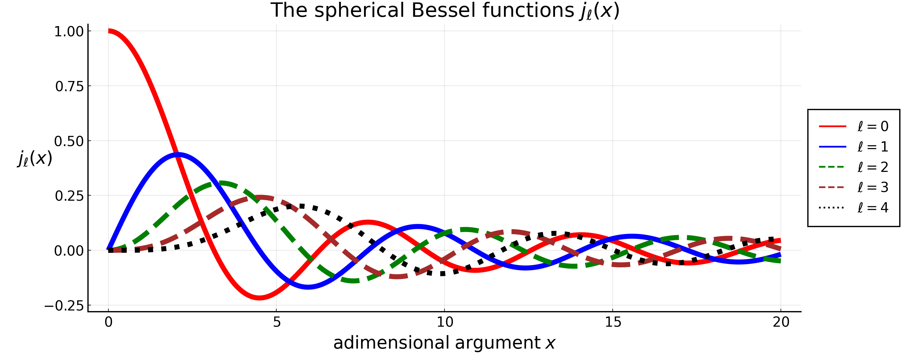

# The Spherical Bessel Functions ``j_\ell(x)``

```@contents
Pages = ["SphericalBesselFunctions.md"]
Depth = 3
```

Acronyms used for the sources:

- DLMF = Digital Library of Mathematical Functions
- NIST = National Institute of Standards and Technology

Sources:

- [U.S. NIST DLMF, Chapter 10 - Spherical Bessel Functions](https://dlmf.nist.gov/10#PT4)
  * Spherical Bessel functions Taylor series: [Section 10.53](https://dlmf.nist.gov/10.53)
  * Recurrence relations and derivatives: [Section 10.51](https://dlmf.nist.gov/10.51)
  * Relations between the two kinds: [Section 10.47](https://dlmf.nist.gov/10.47)


## Definition

Spherical Bessel functions are the solutions to the following differential equation:

```math
    x^2 \frac{\mathrm{d}^2 y}{\mathrm{d} x^2}
    + 2 x \frac{\mathrm{d} y}{\mathrm{d} x}
    + \left(x^2 - \ell(\ell+1)\right) y = 0 \, .
```

They are indexed by the order ``\ell``. Two independent solutions are ``j_\ell(x)`` and ``y_\ell(x)``, the spherical Bessel functions
of the first and second kind, respectively.

These functions are related to ordinary Bessel functions by

```math
    j_\ell(x) = \sqrt{\frac{\pi}{2 x}} J_{\ell + 1/2}(x)
    \quad ,\quad \quad \quad
    y_\ell(x) = \sqrt{\frac{\pi}{2 x}} Y_{\ell + 1/2}(x)
        = (-1)^{\ell+1} \sqrt{\frac{\pi}{2 x}} J_{-\ell - 1/2}(x) \, .
```

For integer ``\ell``, the spherical Bessel functions of the first and second kind are related to each other by

```math
    y_\ell(x) = (-1)^{\ell+1}j_{-\ell-1}(x)
    \quad , \quad \quad \quad
     j_\ell(x) = (-1)^{\ell}y_{-\ell-1}(x) \, .
```

In this appendix, we focus only on the spherical Bessel functions of the first kind with integer order ``\ell \geq 0``.

The first few ``j_\ell(x)`` are the following:

```math
\begin{align*}
    &j_0(x) = \frac{\sin(x)}{x} \, ,\\[6pt]
    &j_1(x) = \frac{\sin(x)}{x^2} - \frac{\cos(x)}{x} \, , \\[6pt]
    &j_2(x) = \frac{3\sin(x)}{x^3} - \frac{\sin(x)}{x}- \frac{3\cos(x)}{x^2} \, .
\end{align*}
```




## Properties

### Rayleigh's formula

```math
    j_\ell(x) = (-x)^\ell
        \left(\frac{1}{x} \frac{\mathrm{d}}{\mathrm{d} x}\right)^\ell
        \frac{\sin(x)}{x}
```

### Value in zero

```math
    j_\ell(0) =
    \begin{cases}
        1 \; , \quad & \ell = 0 \\[4pt]
        0 \; , \quad & \forall \, \ell > 0
    \end{cases}
```

### Series expansion near zero

```math
    j_\ell(x) = x^\ell \left(
        \frac{\sqrt{\pi}}{2^{\ell+1}\, \Gamma(\ell + 3/2)} + \mathcal{O}(x^2)
    \right)
    = \frac{x^\ell}{(2\ell+1)!!} \left(1 + \mathcal{O}(x^2)\right)
```

The two forms are the same thing, because
``\Gamma(\ell + 3/2) = \sqrt{\pi} \, (2\ell+1)!! \, / \, 2^{\ell+1}``.
The complete series is

```math
    j_\ell(x) = \sum_{k=0}^{\infty} \frac{(-1)^k \, x^{\ell + 2k}}
        {2^k \, k! \, (2\ell + 2k + 1)!!} \; ,
```

which is the one used to derive the small-``s`` limits of the
[``I_\ell^n`` integrals](IlnIntegrals.md).

### Parity

```math
    j_\ell(-x) = (-1)^\ell j_\ell(x)
```

### Recursive relations

```math
    j_{\ell+1}(x) = \frac{\ell}{x}j_\ell(x) - \frac{\mathrm{d} j_\ell(x)}{\mathrm{d} x}
```

```math
    j_{\ell+1}(x) = \frac{2\ell+1}{x}j_\ell(x) - j_{\ell-1}(x)
```

### Orthogonality

```math
    \int_{-\infty}^{+\infty}\mathrm{d} x \, j_m(x) \, j_n(x) =
    \frac{\pi}{2m+1}\delta_{mn}
```

Note that the integration must run over the whole real axis: for ``m - n`` odd the
integrand is odd and the result vanishes by parity, while for ``m - n`` even and
``m \neq n`` it vanishes by the Weber-Schafheitlin formula below. Restricted to
``[0, +\infty)``, the ``m \neq n`` terms with ``m-n`` odd are *not* zero.

### Closure relation

```math
    \frac{2}{\pi}\int_{0}^{\infty}\mathrm{d} x \,
    x^2\, j_\ell(k_1 x) \, j_\ell(k_2 x) =
    \frac{\delta_{\rm D}(k_1-k_2)}{k_1^2}
```

### Rayleigh's expansion of plane waves

```math
    e^{i\mathbf{k}\cdot\mathbf{x}} =
    4 \pi \sum_{\ell=0}^{\infty} \sum_{m=-\ell}^{\ell} \,
    i^\ell \, j_\ell(k x)
    Y_{\ell m}(\hat{\mathbf{k}}) \,
    Y_{\ell m}^{*}(\hat{\mathbf{x}})
```

```math
    e^{i\mathbf{k}\cdot\mathbf{x}} =
    \sum_{\ell=0}^{\infty} (2\ell+1) \, i^\ell \,
    j_\ell(k x) \, \mathcal{L}_{\ell}(\hat{\mathbf{k}}\cdot\hat{\mathbf{x}})
```

where ``\mathcal{L}_\ell`` is the Legendre polynomial of order ``\ell``.

### Known infinite integrals

```math
    \int_{0}^{\infty}\mathrm{d} x \, j_\ell(x) =
    \frac{\sqrt{\pi}\, \Gamma\left(\frac{\ell+1}{2}\right)}
         {2\,\Gamma\left(1+\frac{\ell}{2}\right)}
```

```math
    \int_{0}^{\infty}\mathrm{d} x \, j^2_\ell(x) =
    \frac{\pi}{2(2\ell+1)}
```

```math
    \int_{0}^{\infty}\mathrm{d} x \, x^p \, j^2_\ell(x) =
    \frac{
        \pi \, \Gamma(1-p) \, \Gamma\left(\ell+\frac{p+1}{2}\right)
    }{
        2^{2-p} \, \Gamma^2\left(1-\frac{p}{2}\right) \,
        \Gamma\left(\ell+\frac{3-p}{2}\right)
    }
    \; , \quad -2\ell-1 < p < 1
```

(the previous one is the special case ``p = 0``; outside the stated range the integral
diverges, and the formula correctly returns a pole of the ``\Gamma`` functions).

```math
    \int_{0}^{\infty}\mathrm{d} x \, j_\ell(K x) \, j_\ell(k x)=
    \frac{\pi}{2(2\ell+1)}\frac{K^\ell}{k^{\ell+1}} \; ,
    \quad \forall \, K < k
```

CAREFUL with the last one: it is the **smaller** of the two arguments that goes to the
numerator, so the condition is ``K < k`` and not the other way round. A quick sanity
check is ``K \rightarrow k``, which gives back ``\pi / [2(2\ell+1)k]``, i.e. the
previous integral rescaled; the other ordering would instead diverge for
``K \gg k``, which is impossible since ``|j_\ell| \leq 1``.


## The first zero of ``j_\ell(x)``

From linear regression on ``0 \leq \ell \leq 100``, the first zero of ``j_\ell(x)`` occurs roughly around

```math
    x \simeq 4.75 + 1.05 \, \ell \; .
```

Note that this is an overestimate for very low ``\ell``: ``j_0(x)`` has its first zero at ``x = \pi``,
``j_1(x)`` at ``x \simeq 4.493`` and ``j_2(x)`` at ``x \simeq 5.764``. The fit is instead accurate
at large ``\ell``, where the exact asymptotic expansion reads
``x \simeq \ell + 1.8557 \, \ell^{1/3} + \mathcal{O}(\ell^{-1/3})``.
