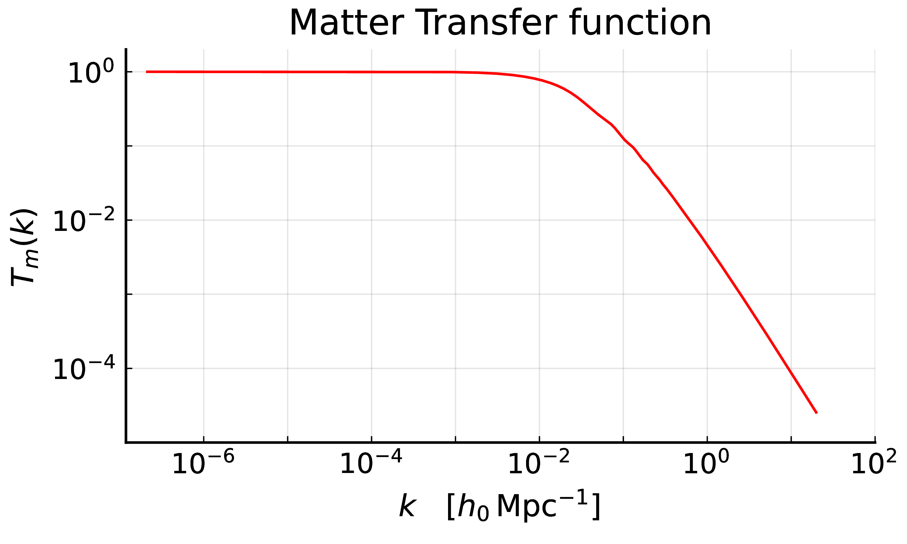

# The input Power Spectrum

Everything GaPSE computes starts from a tabulated matter Power Spectrum ``P(q)``, read
by `InputPS`. Its two **asymptotic power laws** — the one at small ``q`` and the one at
large ``q`` — are not a detail: they decide whether each moment

```math
    \sigma_i = \int_{k_\mathrm{min}}^{k_\mathrm{max}} \frac{\mathrm{d}q}{2\pi^2}
    \, q^{\,2-i} \, P(q)
```

(Eq.(3) of [The ``I_\ell^n`` integrals](theory_IlnIntegrals.md)) is a number on its own,
or only together with the range it is computed over. Since the
``\Delta\chi \rightarrow 0`` limits of every TPCF reduce to combinations of ``\sigma_i``
(see [The ``\Delta\chi \rightarrow 0`` limits](theory_DeltaChiLimits.md)), and the
``I_\ell^n`` reduce to them as ``s \rightarrow 0``
(see [The ``I_\ell^n`` integrals](theory_IlnIntegrals.md)), the answer matters.

```@contents
Pages = ["theory_InputPowerSpectrum.md"]
Depth = 3
```


## The matter Power Spectrum at present day

In the ``\Lambda``-CDM cosmology, the primordial curvature perturbations ``\mathcal{R}`` are Gaussian, with a pure power-law spectrum (see the [Planck 2018 results, A&A 641, A10 (2020)](https://doi.org/10.1051/0004-6361/201833887)).
Their power spectrum ``P_\mathcal{R}(k)`` is defined through the two-point function in Fourier space:

```math
    \langle \mathcal{R}(\mathbf{k}) \, \mathcal{R}^*(\mathbf{k}') \rangle
        = (2\pi)^3 \, \delta_\mathrm{D}^{(3)}(\mathbf{k} - \mathbf{k}') \, P_\mathcal{R}(k)
    \quad \quad (\mathrm{P}.1)
```

and it is usually quoted through the dimensionless power spectrum ``\Delta^2_{\mathcal{R}}``, which at large scales goes as:

At large scales, it's known that:

```math
\begin{align*}
    \Delta^2_{\mathcal{R}}(k)  := \frac{k^3}{2\pi^2} P_\mathcal{R}(k) 
        &\underset{k \rightarrow 0^{+}}{\sim} \; A_s \, \left( \frac{k}{k^*}\right)^{n_s-1} &&(\mathrm{P}.2)\\[10pt]

    n_s&\approx 0.965&&\mathrm{primordial \; spectral \; index}\\[8pt]
    \ln(10^{10} A_s) &\approx 3.043 &&\mathrm{ log \; power \; of \; primordial \; curvature \; perturbations} \Rightarrow A_s \approx 2.10 \times 10^{-9}\\[8pt]
    k^* &\approx 0.05 \; \mathrm{Mpc}^{-1}  &&\mathrm{arbitrary \; pivot \; scale}
\end{align*}
```

The factor ``k^3 / 2\pi^2`` in the definition of ``\Delta^2_{\mathcal{R}}`` is chosen such that

```math
\langle \mathcal{R}^2 \rangle = \int \mathrm{d}\ln k \, \Delta^2_\mathcal{R}(k)
```

so ``n_s = 1`` corresponds to a scale-invariant spectrum.

What enters the ``I_\ell^n`` is the matter Power Spectrum ``P_m(k,z)`` at present day (``z=0``), 
a dimensional quantity in ``(h^{-1}\mathrm{Mpc})^3``, defined as in (P.1) with ``\mathcal{R} \rightarrow \delta_m``.
The two are related by the Poisson equation and the matter transfer function ``T(k)``; we'll refresh the derivation of their relation.

We start from the Poisson equation in real comoving space, valid from the matter-dominated epoch onwards, 
when radiation is negligible and the cosmological constant does not cluster:

```math
    \nabla^2 \phi(\mathbf{s}, z) = - \frac{4 \pi G}{c^2} \, a^2(z) \, \langle\rho_m(z)\rangle \, \delta_m(\mathbf{s}, z)
    \quad \quad (\mathrm{P}.3)
```

where:

- the minus sign comes from the fact that we define ``\phi`` as minus the Newtonian gravitational potential
- the ``c^2`` arises because we set the gravitational potentials as adimensional quantities
- the ``a^2`` because the Laplacian is taken with respect to the comoving coordinates ``\mathbf{s}``.


In General Relativity, (P.3) holds on all linear scales if ``\delta_m`` is the comoving-gauge density contrast, which at late times coincides with the synchronous-gauge one computed by CLASS.

The matter density dilutes as ``a^{-3} = (1+z)^3``, and its present-day value is fixed by the first Friedmann equation for a flat Universe, with ``H(z) = a^{-1} \mathrm{d}a/\mathrm{d}t`` the non-comoving Hubble parameter and ``\Omega_{\mathrm{M}0}`` the present-day matter density parameter:


We replace ``\langle{\rho}\rangle``  with the first Friedmann equation for a flat Universe

```math

    \left(\frac{\mathrm{d}{a}}{\mathrm{d}t}\right)^2 = \frac{4 \pi G}{3}\langle\rho\rangle a^2 \, ,
```

```math
    H^2(z) = \frac{8 \pi G}{3} \, \bar{\rho}_\mathrm{tot}(z)
    \quad \Longrightarrow \quad
    \bar{\rho}_m(z) = \frac{3 H_0^2}{8 \pi G} \, \Omega_{\mathrm{M}0} \, (1+z)^3
    \quad \quad (\mathrm{P}.4)
```

Inserting (P.4) in (P.3) and going to Fourier space (``\nabla^2 \rightarrow -k^2``), we obtain:

```math
    k^2 \, \phi(\mathbf{k}, z) = \frac{3}{2} \, \Omega_{\mathrm{M}0}
        \frac{H_0^2}{c^2} \, (1+z) \, \delta_m(\mathbf{k}, z)
    \quad \quad (\mathrm{P}.5)
```

For an accurate description, we need to relate the potential at redshift ``z`` to the primordial one ``\phi_p``, i.e. its value on super-horizon scales during matter domination.
This is done through the matter transfer function ``T(k)``, which describes the evolution of perturbations through the epochs of horizon crossing and radiation/matter transition, and the linear growth factor ``D(z)``:

```math
    \phi(\mathbf{k}, z) = \phi_p(\mathbf{k}) \, T(k) \, (1+z) \, D(z)
    \quad \quad (\mathrm{P}.6)
```

Here ``D(z)`` is normalized such that ``D(z) = (1+z)^{-1}`` during matter domination, when the potential is therefore constant; it decays only once the cosmological constant dominates.
This factorization holds at late times, as long as the growth is scale-independent (e.g. neglecting massive neutrinos).

Below we plot the matter transfer function ``T(k)`` at redshift ``z = 0``, obtained from the CLASS code.



The transfer function is normalized such that it goes to ``1`` at large scales, i.e. for modes that entered the horizon well after matter-radiation equality.
At small scales it is asymptotic to ``k^{-2}\ln k``: the potential of modes entering the horizon during radiation domination decays, while the matter perturbations grow only logarithmically (Mészáros effect):

```math
    \begin{aligned}
        & T(k) \xrightarrow[k \rightarrow 0^{+}]{} 1 \\[10pt]
        & T(k) \underset{k \rightarrow +\infty}{\sim} k^{-2}\ln k
    \end{aligned}
    \quad \quad (\mathrm{P}.7)
```

Combining (P.5) and (P.6), the factor ``(1+z)`` cancels out and the matter density contrast turns out to be linear in the primordial potential:

```math
    \delta_m(\mathbf{k}, z) = \alpha(k,z) \, \phi_p(\mathbf{k}) \, ,
    \qquad \qquad
    \alpha(k,z) := \frac{2}{3}
        \frac{k^2 \, T(k) \, D(z)}{\Omega_{\mathrm{M}0}}
        \left(\frac{c}{H_0}\right)^2
    \quad \quad (\mathrm{P}.8)
```

The primordial potential is in turn fixed by the curvature perturbation.
On super-horizon scales ``\mathcal{R}`` is conserved and, for a constant equation of state ``w`` and no anisotropic stress, the potential is constant as well, with:

```math
    \phi = \frac{3(1+w)}{5+3w} \, \mathcal{R}
    \quad \Longrightarrow \quad
    \phi_p(\mathbf{k}) = \frac{3}{5} \, \mathcal{R}(\mathbf{k})
    \quad \quad (\mathrm{P}.9)
```

where the last equality holds in matter domination (``w = 0``).
During radiation domination (``w = 1/3``) one has instead ``\phi = 2\mathcal{R}/3``: the ratio ``9/10`` between the two is the well-known suppression of the super-horizon potential across matter-radiation equality.
The overall sign depends on the convention adopted for ``\mathcal{R}``, and drops out of the power spectrum.

Inserting (P.9) in (P.8) and computing the two-point function as in (P.1), we finally obtain the matter power spectrum:

```math
    P_m(k, z) = \frac{9}{25} \, \alpha^2(k, z) \, P_\mathcal{R}(k)
        = \frac{4}{25} \, \frac{k^4 \, T^2(k) \, D^2(z)}{\Omega_{\mathrm{M}0}^2}
        \left(\frac{c}{H_0}\right)^4 P_\mathcal{R}(k)
    \quad \quad (\mathrm{P}.10)
```

i.e. ``P_m \propto k^4 \, T^2(k) \, D^2(z) \, P_\mathcal{R}(k)``. Using the power law (P.2), this becomes:

```math
    P_m(k, z) = \frac{8 \pi^2}{25} \, \frac{A_s}{\Omega_{\mathrm{M}0}^2}
        \left(\frac{c}{H_0}\right)^4 k_*^{1 - n_s} \, k^{n_s} \, T^2(k) \, D^2(z)
    \quad \quad (\mathrm{P}.11)
```

Given (P.7), ``P_m \propto k^{n_s}`` at large scales and ``P_m \propto k^{n_s - 4} \ln^2 k`` at small ones, with the turnover set by the horizon scale at matter-radiation equality, ``k_\mathrm{eq} \simeq 0.015 \, h \, \mathrm{Mpc}^{-1}``.
With ``k`` in ``h \, \mathrm{Mpc}^{-1}``, one has ``c/H_0 \simeq 2997.92 \, h^{-1}\mathrm{Mpc}`` and ``k_* = (0.05/h) \, h \, \mathrm{Mpc}^{-1}``, so that ``P_m`` is in ``(h^{-1}\mathrm{Mpc})^3``.

!!! note "Normalization of the growth factor"
    In (P.6)-(P.11) ``D(z)`` is normalized such that ``D(z) = (1+z)^{-1}`` during matter domination, which gives ``D(0) \simeq 0.79`` for ``\Omega_{\mathrm{M}0} \simeq 0.315``.
    If a growth factor ``\tilde{D}(z)`` normalized as ``\tilde{D}(0) = 1`` is used instead, replace ``D(z) \rightarrow D(0) \, \tilde{D}(z)`` in these equations.


## The small-``k`` slope

Everything needed is already in (P.2) and (P.11). On large scales the transfer function
is ``1`` by construction, (P.7), so (P.11) reduces to a pure power law:

```math
\begin{align*}
    (\mathrm{P}.11) \; \mathrm{with} \; T(k) \rightarrow 1 \; : \quad \quad
    P_m(k, z=0) &\; \propto \; k^{\,n_s} \, T^2(k) \, D^2(0) \\[10pt]
    &\underset{k \rightarrow 0^{+}}{\sim} \; k^{\,n_s}
\end{align*}
```

```math
\boxed{
    P(k) \; \underset{k \rightarrow 0^{+}}{\sim}  \, k^{\,n_P} \; , \quad \quad
    n_P = n_s \simeq 0.96
}
\quad \quad (\mathrm{P}.12)
```

The matter Power Spectrum therefore **grows** as ``k^{+0.96}`` at small ``k``, while the
dimensionless curvature ``\Delta^2_\mathcal{R}`` *falls* as
``k^{\,n_s-1} \simeq k^{-0.035}``. The two are not in conflict: the four powers of ``k``
supplied by the Poisson equation, minus the three of the
``\Delta^2_\mathcal{R} \leftrightarrow P_\mathcal{R}`` conversion (P.2), are exactly what
separates them. The distinction matters because ``n_P`` and ``n_s - 1`` are easy to
confuse, and it is ``n_P`` that governs the ``I_\ell^n``.

This is directly visible in `data/WideA_ZA_pk.dat`, whose local slope
``\mathrm{d}\ln P / \mathrm{d}\ln k`` is ``+0.9600`` over the first decade of the
tabulated range, with an amplitude of order ``10^{6} \, (h^{-1}\mathrm{Mpc})^3``.

## The large-``k`` tail

At the other end the transfer function is no longer ``1``. For CDM it falls as
``T(k) \propto k^{-2}\ln k``, so

```math
    P_m(k) \; \underset{k \rightarrow +\infty}{\sim} \; k^{4} \, T^2(k) \, k^{\,n_s-4}
    \; \sim \; k^{\,n_s - 4} \, \ln^2 k \; \simeq \; k^{-3} \, \ln^2 k
    \quad \quad (\mathrm{P}.13)
```

That ``k^{-3}`` is the exponent that matters for the moments (3) of
[The ``I_\ell^n`` integrals](theory_IlnIntegrals.md), and it is **not** what GaPSE
actually uses. `InputPS` continues the tabulated spectrum with a power law
``P(q) = a + b \, q^{\,s}`` fitted on `[fit_right_min, fit_right_max]`, and on
`data/WideA_ZA_pk.dat` that fit gives

```math
    P(q) \; \underset{q \, > \, 20.2}{=} \; 91.60 \; q^{-2.641}
    \quad \quad (\mathrm{P}.14)
```

i.e. a tail *shallower* than the asymptotic ``k^{-3}``, simply because at
``k \simeq 20 \, h\,\mathrm{Mpc}^{-1}`` the true spectrum has not reached its asymptote yet.

## Which ``\sigma_i`` survive the removal of the cuts

Over the range of its definition, Eq.(3) of
[The ``I_\ell^n`` integrals](theory_IlnIntegrals.md), every ``\sigma_i`` is a finite
number. The question this section answers is a different one: **which of them would still
be finite if the two cuts were removed**, i.e. which of them can be quoted without also
quoting ``k_\mathrm{min}`` and ``k_\mathrm{max}``.

Inserting ``P \sim q^{\,s}`` into the definition of ``\sigma_i``, the integrand goes as
``q^{\,2-i+s}``. The
integral converges at ``q \rightarrow 0`` when ``2-i+s > -1``, and at
``q \rightarrow +\infty`` when ``2-i+s < -1``. With ``s = +0.960`` on the left and
``s = -2.641`` on the right:

| | IR exponent | IR | UV exponent | UV |
|:--|--:|:--|--:|:--|
| ``\sigma_0`` | ``+2.960`` | converges | ``-0.641`` | **diverges** |
| ``\sigma_1`` | ``+1.960`` | converges | ``-1.641`` | converges |
| ``\sigma_2`` | ``+0.960`` | converges | ``-2.641`` | converges |
| ``\sigma_3`` | ``-0.040`` | converges | ``-3.641`` | converges |
| ``\sigma_4`` | ``-1.040`` | **diverges** | ``-4.641`` | converges |

Two of the five would not exist as numbers **if the range were infinite**, and this is
where the wording has to be careful.

- **``\sigma_0`` has no ``k_\mathrm{max} \rightarrow +\infty`` limit.** With the true tail
  (P.13) its integrand goes as ``q^{-1}``, so the integral would grow logarithmically;
  with the fitted tail (P.14) it grows as ``\sigma_0(<K) \sim K^{\,0.359}``. That is a
  property of ``P(q)``, not a defect: ``\sigma_0`` is the density variance
  ``\langle \delta^2 \rangle`` smoothed on *zero* scale, which is not a finite quantity in
  CDM.
- **``\sigma_4`` has no ``k_\mathrm{min} \rightarrow 0`` limit**, its integrand going as
  ``q^{-1.040}`` there.

Neither statement says that anything in GaPSE diverges. The moments are **defined** over
``[k_\mathrm{min}, k_\mathrm{max}]``, exactly as the ``I_\ell^n`` that they are the limit
of, and over that range all five are ordinary finite numbers. What the two statements do
say is that ``\sigma_0`` and ``\sigma_4`` *depend on the range* and cannot be quoted
without it, while ``\sigma_1``, ``\sigma_2`` and ``\sigma_3`` are insensitive to it: they
would converge even if the cuts were removed, so any reasonable choice gives the same
number.

This is the same point made from the other side in
[Why the cut cannot be dropped](theory_IlnIntegrals.md#why-the-cut-cannot-be-dropped):
the range belongs to the definition, for the ``\sigma_i`` just as for the ``I_\ell^n``,
and the two must use the same one for
``I_\ell^n(s) \rightarrow \sigma_{n-\ell}s^{\ell-n}/(2\ell+1)!!`` to hold — which,
numerically, it does to six digits.

Measured on `data/WideA_ZA_pk.dat`, with ``k_\mathrm{min} = 10^{-5}``:

| ``k_\mathrm{max}`` |    ``1`` |     ``10`` |   ``10^2`` |   ``10^3`` |   ``10^4`` |
| :----------------- | -------: | ---------: | ---------: | ---------: | ---------: |
| ``\sigma_0``       | ``3.41`` |   ``18.6`` |   ``56.5`` |    ``143`` |    ``341`` |
| ``\sigma_2``       | ``98.8`` | ``101.06`` | ``101.13`` | ``101.13`` | ``101.13`` |

``\sigma_2`` has settled by ``k \simeq 1`` and is then flat to five digits.
``\sigma_0`` never settles, and it is important to read that correctly: it is not a
numerical problem that a finer grid or a wider range would cure. With the fitted tail
(P.14) every extra decade of ``k`` multiplies it by ``10^{\,0.359} \simeq 2.3``, for ever.
A cumulative plot of ``\sigma_0(<k)`` therefore **cannot** show a plateau — by
construction, not by accident — and the value of ``\sigma_0`` is whatever the integral
reaches at ``k_\mathrm{max}``. This is why ``k_\mathrm{max}`` is part of the definition
and not a convergence parameter.


### What this means for the ``\Delta\chi \rightarrow 0`` limits

``\sigma_0`` enters five limit branches — the three of the Lensing-Lensing family
(``3\sigma_2 + \frac{6}{5}\chi_1^2\sigma_0``) and the two of Newtonian ``\times``
Lensing (``-s_1(f_1+5b_1)\sigma_0/5``). Since ``\sigma_0`` depends on the range, those
five results depend on it too, and the choice is not free: the limit branch replaces
``I_0^0(\Delta\chi)`` for ``\Delta\chi < \Delta\chi_\mathrm{min}``, so the ``\sigma_0``
it needs is the one belonging to the same integral, i.e. computed over the
``[k_\mathrm{min}, k_\mathrm{max}]`` of (1) in
[The ``I_\ell^n`` integrals](theory_IlnIntegrals.md).

Two consequences follow, and they pull in opposite directions:

1. **the ranges must agree.** `IPSTools` hard-codes ``[10^{-5}, 10^{3}]`` for the
   `xicalc` call that builds the ``I_\ell^n``, while the stored ``\sigma_i`` use its
   `k_min`/`k_max` keywords. When the two differ, the limit branch and the
   ``J \, I_\ell^n`` branch are describing different integrals. For ``\sigma_2`` and
   ``\sigma_3`` this is immaterial; for ``\sigma_0`` it is a factor of several;
2. **the limit is only reached below ``1/k_\mathrm{max}``.** Condition (1.3) of the
   ``I_\ell^n`` page says the asymptotic form holds for
   ``s \ll 1/k_\mathrm{max}``. With ``k_\mathrm{max} = 10^{3}`` that is
   ``s \ll 10^{-3}``, far below the ``\Delta\chi_\mathrm{min} = 0.1`` at which the branch
   actually switches over, where ``I_0^0(0.1) = 23.7`` against ``\sigma_0 = 143.3``.

The second point is the sharper one, and it is a genuine approximation in the code rather
than a matter of bookkeeping: at the switch-over the true ``I_0^0`` has not yet reached
its asymptotic value. Using a ``\sigma_0`` computed over
``[k_\mathrm{min}, 1/\Delta\chi_\mathrm{min}]`` instead of the full range would make the
two branches agree at the boundary — ``\sigma_0(<10) = 18.6`` against
``I_0^0(0.1) = 23.7`` — and it is what the default `IPSTools`
``k_\mathrm{max} = 10`` amounts to. Both options are stated here rather than left
implicit; the code currently uses the stored ``\sigma_i``.

## The figures

```@raw html

```

``P(q)`` over twelve decades. Outside the tabulated range (grey lines) the solid curve
*is* the dashed power law, which is the point of the figure: what GaPSE integrates
beyond ``q \simeq 20`` is the extrapolation (P.14), not data.

```@raw html

```

The same information as a local slope ``\mathrm{d}\ln P/\mathrm{d}\ln q``: flat at
``+0.960`` on the left, flat at ``-2.641`` on the right, with the turnover around the
equality scale in between. The dotted line marks the ``-3`` of (P.13), which the fitted
tail does not reach.

## Reproducing the figures

Both figures, and the tables above, are produced by the notebook
`theory/input_ps.ipynb`:

```bash
$ cd theory
$ jupyter lab input_ps.ipynb
```

The companion notebook `theory/sigma_i.ipynb` plots the five ``\sigma_i`` integrands and
the fraction of each moment collected below a given ``q``, and lets any pair of
integration extremes be tried.
